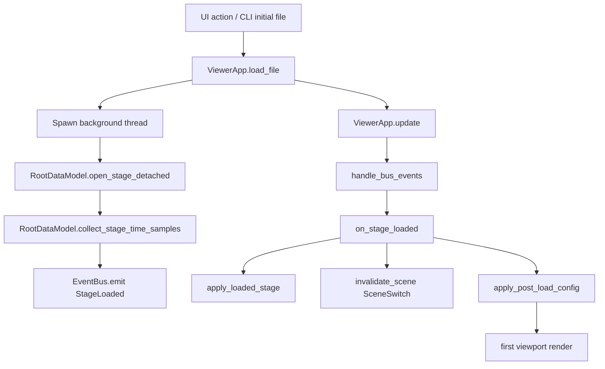
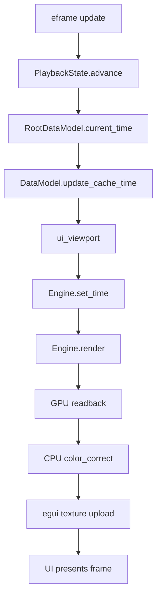
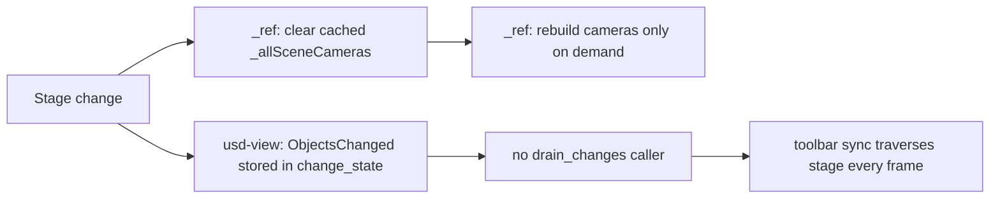
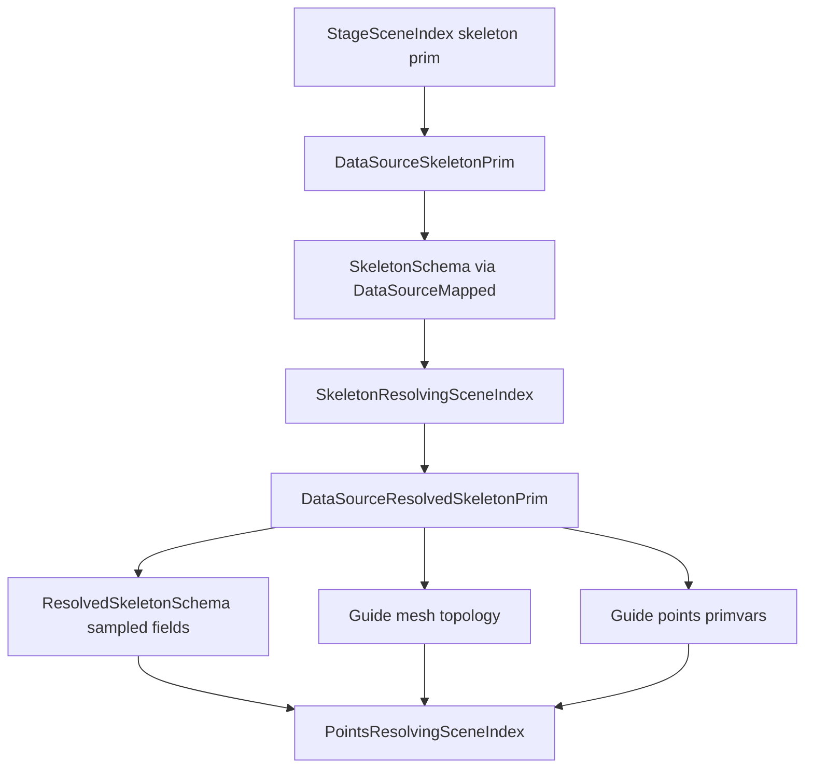
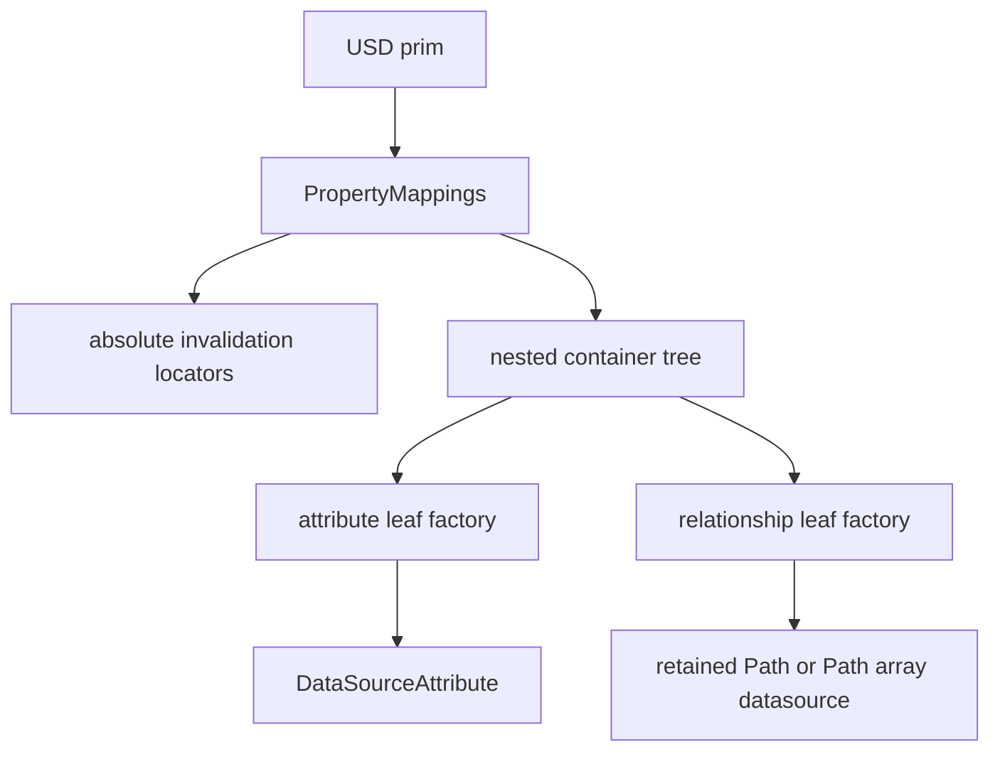
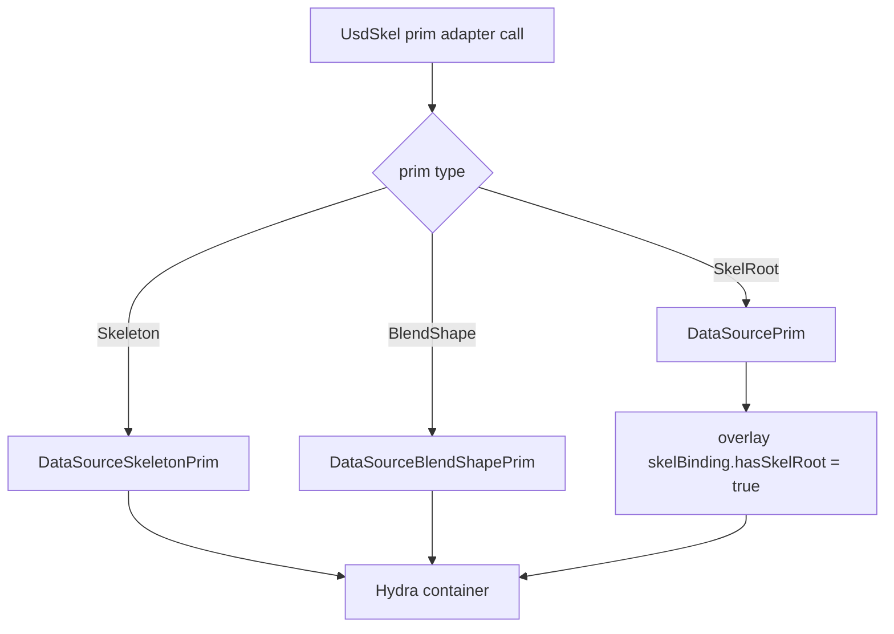
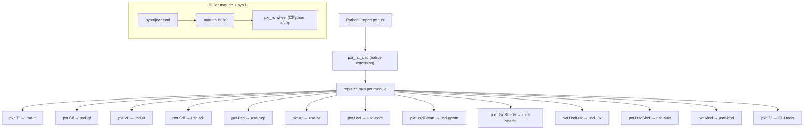
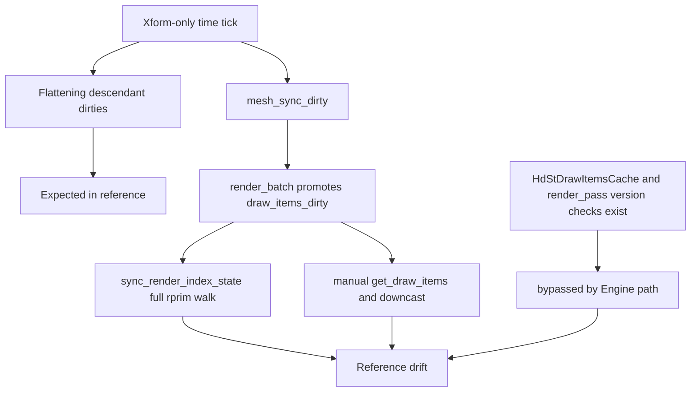

# Diagrams

## usd-view Stage Load



## usd-view Playback Hot Path



## Camera List Drift vs Reference



## usdSkel Resolving Path



## DataSourceMapped Tree



## Legacy Skel Adapter Parity



## Adapter Resolution Fallback

```mermaid
flowchart TD
    A[AdapterRegistry.find_for_prim] --> B{direct type hit}
    B -->|yes| C[return registered adapter]
    B -->|no| D[scan registered adapter types]
    D --> E[filter prim.is_a(type)]
    E --> F[pick deepest schema match]
    F --> G{found}
    G -->|yes| H[return inherited adapter]
    G -->|no| I[NoOpAdapter]
```

## Flo Animation Rust Path

```mermaid
flowchart LR
    engineSetTime[Engine.set_time] --> stageSetTime[StageSceneIndex.set_time]
    stageSetTime --> stageGlobals[StageGlobalsImpl.set_time]
    stageGlobals --> dirtiedEntries[DirtiedPrimEntry x tracked path]
    dirtiedEntries --> adapterDirty[HdSceneIndexAdapterSceneDelegate.prims_dirtied]
    dirtiedEntries --> flatteningDirty[HdFlatteningSceneIndex.on_prims_dirtied]
    flatteningDirty --> extraDirty[descendant dirty fanout]
    adapterDirty --> renderIndexDirty[HdRenderIndex.mark_rprim_dirty]
    extraDirty --> renderIndexDirty
    renderIndexDirty --> renderBatch[Engine.render_batch]
    renderBatch --> syncAll[HdEngine.execute and HdRenderIndex.sync_all]
    syncAll --> viewerRefresh[Engine.sync_render_index_state]
    viewerRefresh --> manualDrawGather[Engine calls get_draw_items and downcasts]
    manualDrawGather --> renderPassSet[HdStRenderPass.set_draw_items]
    renderPassSet --> hgiExecute[HdStRenderPass.execute_with_hgi]
```



## Flo Animation Reference Path

```mermaid
flowchart LR
    prepareBatch[UsdImagingGLEngine.PrepareBatch] --> preSetTime[_PreSetTime]
    preSetTime --> refSetTime[StageSceneIndex.SetTime]
    refSetTime --> postSetTime[_PostSetTime]
    postSetTime --> hdExecute[HdEngine.Execute]
    hdExecute --> syncAllRef[HdRenderIndex.SyncAll]
    syncAllRef --> renderTask[HdxRenderTask.Execute]
    renderTask --> renderPassExec[HdSt_RenderPass._Execute]
    renderPassExec --> updateCmd[_UpdateCommandBuffer]
    updateCmd --> updateDraw[_UpdateDrawItems]
    updateDraw -->|state changed| drawItemsFetch[RenderIndex.GetDrawItems]
    updateDraw -->|state unchanged| drawItemsReuse[reuse cached draw-item vector]
```



## Python Bindings (usd-pyo3) Layer



## Flo Divergence Map


