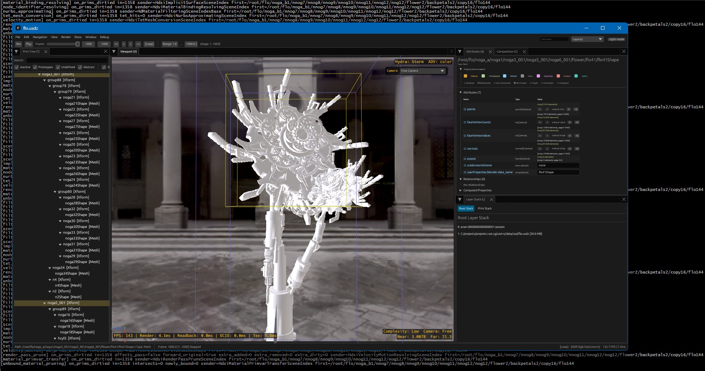

# usd-rs



Pure Rust port of OpenUSD:

- This repository is a pure experimental ground-up rewrite of Pixar's OpenUSD architecture in Rust.
- It is not a binding layer, but a pure Rust implementation.
- The C++ reference lives at [PixarAnimationStudios/OpenUSD](https://github.com/PixarAnimationStudios/OpenUSD) and remains the behavior target for composition, imaging, Hydra, and viewer semantics.
- For architectural details and crate mapping, see [`STRUCTURE.md`](./STRUCTURE.md).
- It's not production ready and is not supposed to be used by anyone.
- This repo is large and still under active work. Sudden changes and API rewrites are to be expected at any moment.


## Workspace

- Core USD crates live under [`crates/usd/`](./crates/usd/)
- Hydra and imaging crates live under [`crates/imaging/`](./crates/imaging/)
- The USD scene delegate lives under [`crates/usd-imaging/`](./crates/usd-imaging/)
- The viewer app lives under [`crates/usd-view/`](./crates/usd-view/)

## Current Viewer Status

Recent work focused on `usd-view` correctness and parity on heavy real-world files.

- `flo.usdz` hierarchical xform animation now propagates time dirties correctly through Hydra.
- Hover/orbit stutter was removed by keeping hover on the fast GPU picking path and avoiding the catastrophic fallback on passive motion.
- Picking correctness was tightened after fixing coordinate/readback issues and selection-tracker churn.
- Viewer first-load framing and free-camera clipping now use composed stage bounds from `BBoxCache` instead of render-index bookkeeping.
- Manual free-camera near/far values are treated as explicit overrides only, not as the default runtime projection policy.
- `bmw_x3.usdc` / `bmw_x3.usdz` camera handling was further tightened so packaged tiny-scene assets use scene-aware free-camera clipping during load and camera motion.
- Workspace compiler warnings were cleaned up and remaining scene-index `unsafe` sites were documented and consolidated where possible.

## Diagnostics

- `usd view <file>` launches the viewer.
- `usd meshdump <file> <primPath> [time]` dumps composed mesh/xform/bounds diagnostics for investigation.
- [`profile_flo_usdz.cmd`](./profile_flo_usdz.cmd) runs a profiled release viewer session for `data/flo.usdz`.

## Validation

Typical checks used during current work:

```powershell
cargo check --quiet -p usd-view
cargo check --quiet -p usd-imaging --lib
cargo check --quiet -p usd-hd-st --lib
```

## Python Bindings (`pxr_rs`)

A drop-in Python package mirroring Pixar's `pxr` module hierarchy, built with PyO3.

### Install

Build from source (requires [maturin](https://www.maturin.rs/) and a Rust nightly toolchain):

```bash
python bootstrap.py b p          # build Python bindings (release)
pip install pxr-rs               # or install from wheel once published
```

### Usage

```python
import pxr_rs as pxr

stage = pxr.Usd.Stage.Open("scene.usda")
for prim in stage.Traverse():
    print(prim.GetPath())

token = pxr.Tf.Token("myPrim")
v = pxr.Gf.Vec3f(1.0, 2.0, 3.0)
path = pxr.Sdf.Path("/World/Mesh")
```

Individual modules can be imported directly:

```python
from pxr_rs import Tf, Gf, Vt, Sdf, Pcp, Ar, Kind, Usd, UsdGeom, UsdShade, UsdLux, UsdSkel
```

### Available modules

| Module | Description |
|--------|-------------|
| `Tf` | Token, Type, Notice |
| `Gf` | Vec2/3/4, Matrix, Quat, Range, BBox3d |
| `Vt` | Value, Array, Dictionary |
| `Sdf` | Path, Layer, Spec, ValueTypeName |
| `Pcp` | PrimIndex, Cache, LayerStack |
| `Ar` | AssetResolver, ResolvedPath |
| `Kind` | Kind registry and tokens |
| `Usd` | Stage, Prim, Attribute, Relationship |
| `UsdGeom` | Mesh, Xform, Camera, BasisCurves, Points, Scope |
| `UsdShade` | Material, Shader, NodeGraph |
| `UsdLux` | DomeLight, DistantLight, RectLight, SphereLight |
| `UsdSkel` | Skeleton, SkelRoot, BlendShape |
| `Cli` | CLI tools as Python functions (see below) |

### CLI tools

The Rust binary provides several USD subcommands. These are also available from Python via `pxr_rs.Cli`:

```python
from pxr_rs import Cli

Cli.cat("model.usda")                              # print layer to stdout
text = Cli.cat("model.usda", capture=True)          # capture as string
Cli.cat("model.usda", out="model.usdc")             # convert format
Cli.tree("model.usda", attributes=True)             # print prim tree
Cli.diff("a.usda", "b.usda")                        # diff two layers
```

From the command line:

```bash
usd cat scene.usda               # print USDA text
usd tree scene.usda              # show prim hierarchy
usd view scene.usda              # launch the viewer
usd diff a.usda b.usda           # diff two files
usd dump scene.usdc              # dump crate structure
usd meshdump scene.usda /Mesh    # mesh diagnostics
```

### bootstrap.py commands

| Command | Description |
|---------|-------------|
| `b` | Build all crates (release) |
| `b p` | Build Python bindings only |
| `b -d` | Build all in debug mode |
| `t` | Run tests |
| `t p` | Run Python binding tests |
| `ch` | Clippy + fmt check |

## References:
  - [ssoj13/usd-refs](https://github.com/ssoj13/usd-refs)
