# DRACO-RS Diagrams

This file is the visual companion to `README.md`, `AGENTS.md`, and `DRACO_PLAN.md`.

It describes the current reference-aligned architecture of `draco-rs` after the completed parity audit.

## Workspace Topology
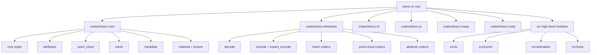

## Layering
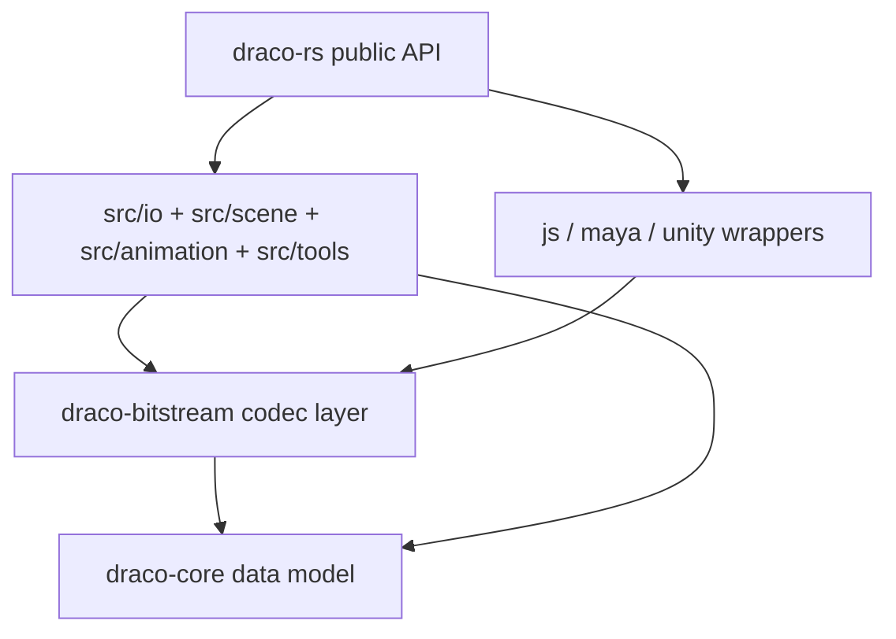

## Draco Decode Pipeline
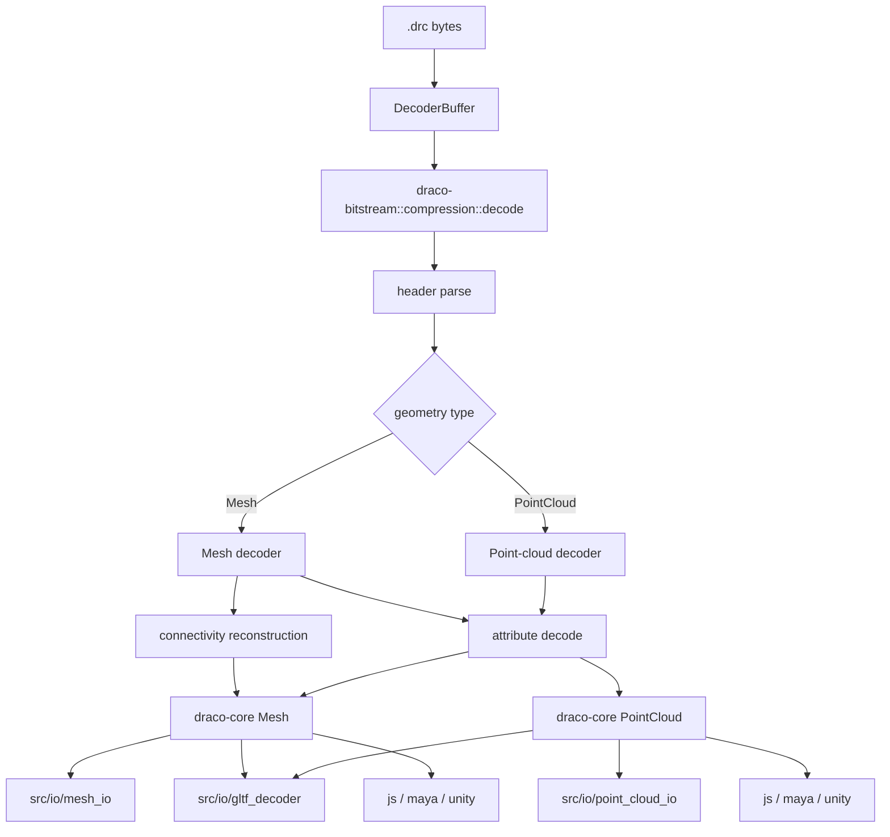

## Draco Encode Pipeline
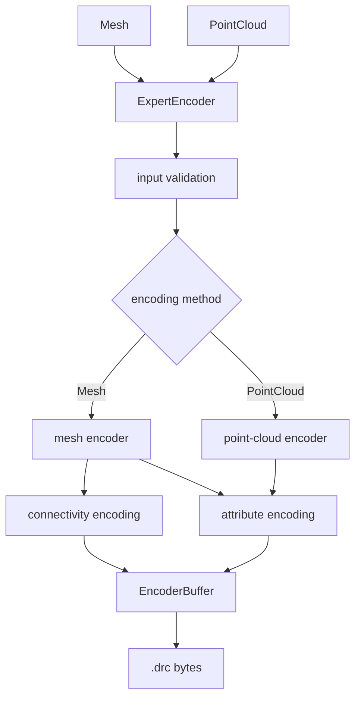

## File IO Dispatch
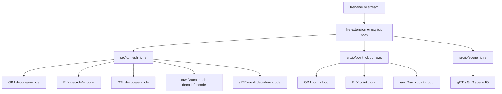

## Reference-Sensitive Decode Semantics
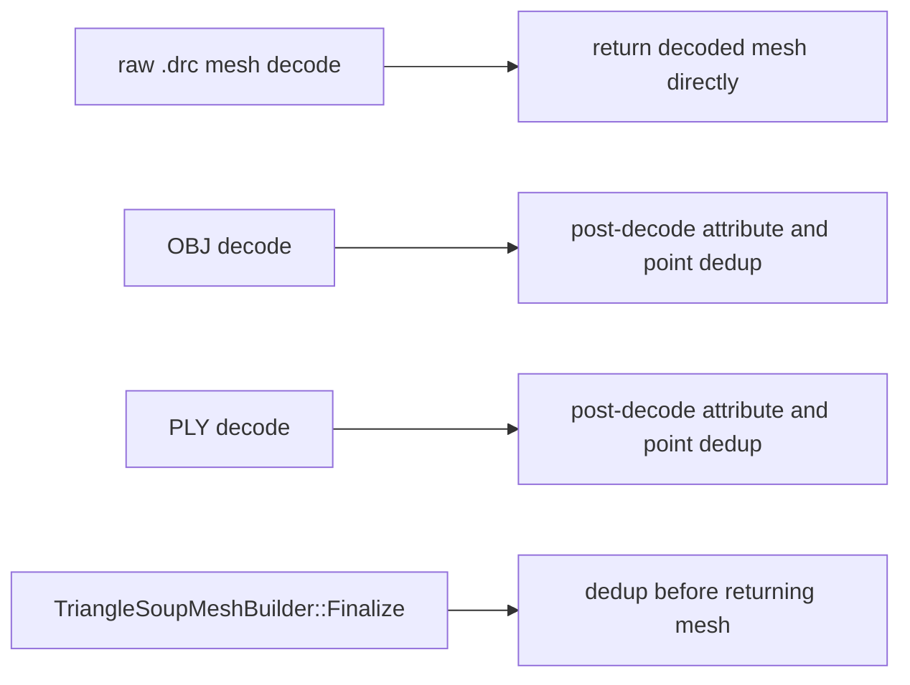

## Mesh and Point-Cloud Point Deduplication
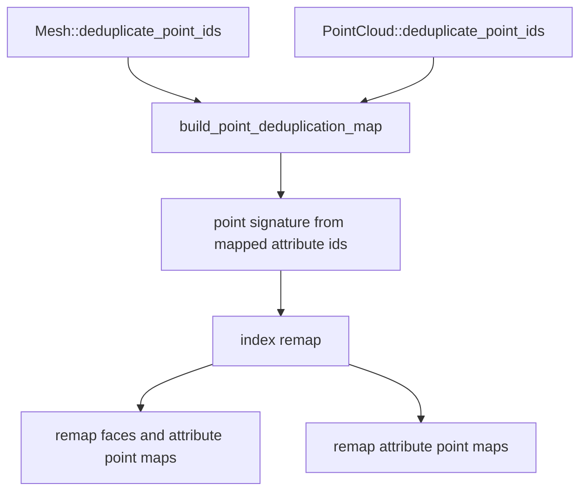

## Point Signature Rule
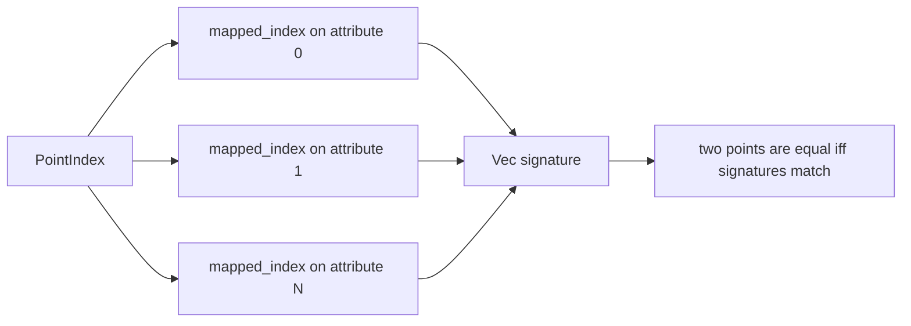

## glTF Scene Flow
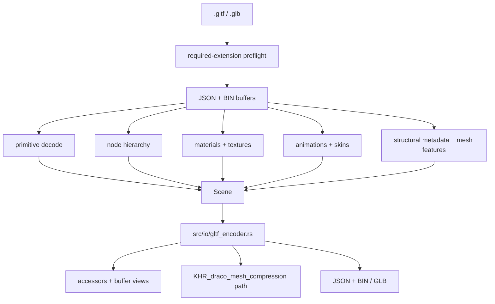

## glTF Extension Support Gate
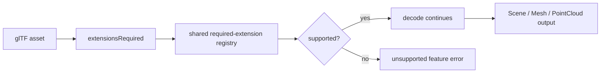

## Scene Material Removal
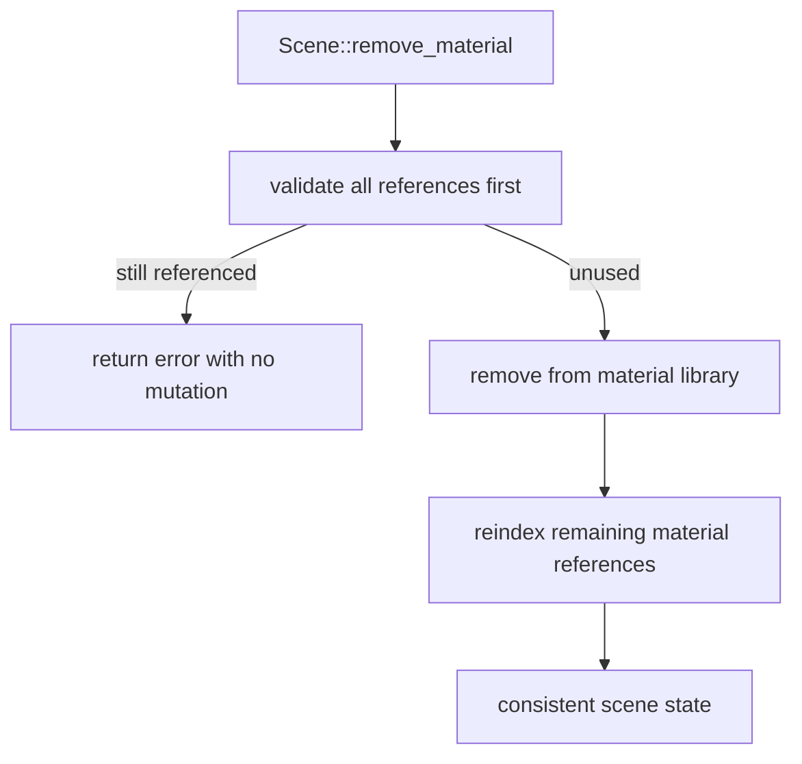

## Metadata Dataflow
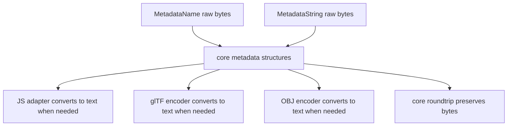

## Binding Ownership Model
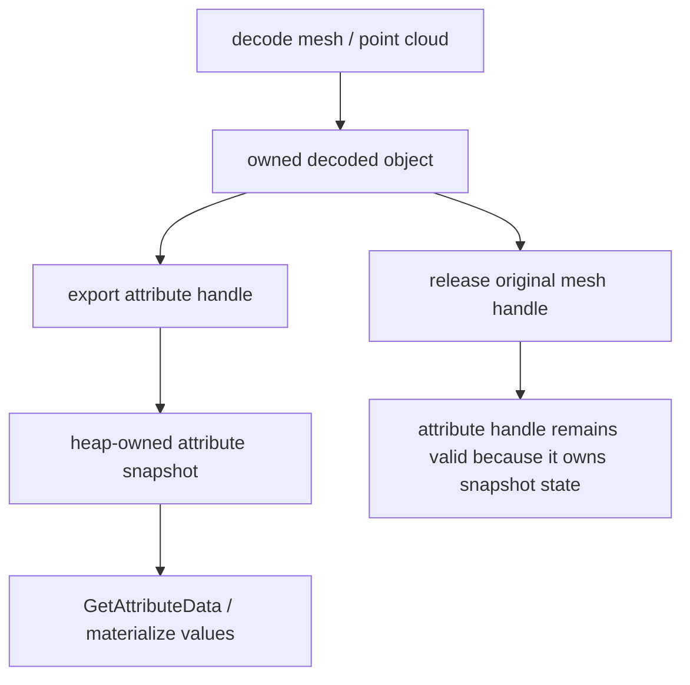

## FFI Error Translation
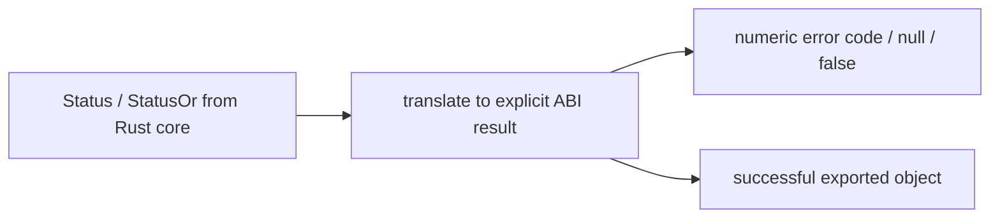

## Validation Workflow
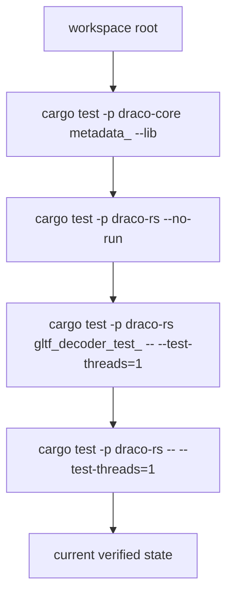

## Isolated Target Directory
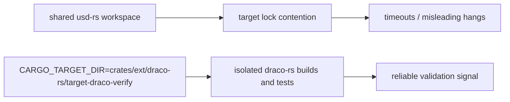

## Document Map
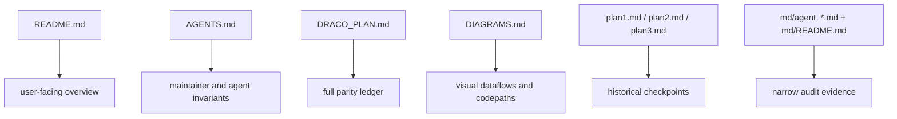
