# mtlx-rs Diagrams

Mermaid diagrams for the mtlx-rs architecture.
Render with any Mermaid-capable viewer (GitHub, VS Code, etc.).

---

## 1. Module Dependency Graph

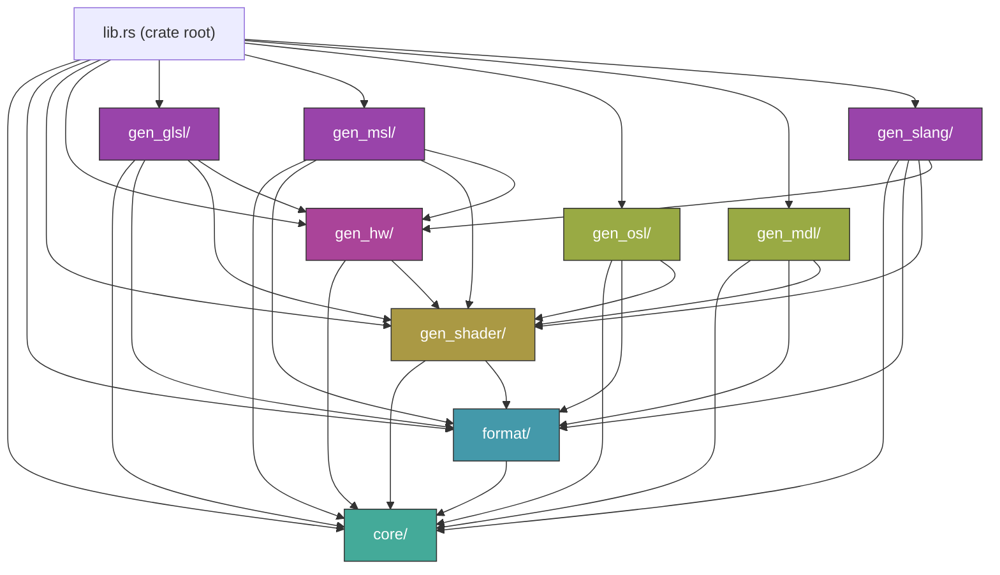
```mermaid
graph TD
    lib["lib.rs (crate root)"]

    lib --> core["core/"]
    lib --> format["format/"]
    lib --> gen_shader["gen_shader/"]
    lib --> gen_hw["gen_hw/"]
    lib --> gen_glsl["gen_glsl/"]
    lib --> gen_msl["gen_msl/"]
    lib --> gen_osl["gen_osl/"]
    lib --> gen_mdl["gen_mdl/"]
    lib --> gen_slang["gen_slang/"]

    format --> core
    gen_shader --> core
    gen_shader --> format
    gen_hw --> core
    gen_hw --> gen_shader
    gen_glsl --> core
    gen_glsl --> format
    gen_glsl --> gen_shader
    gen_glsl --> gen_hw
    gen_msl --> core
    gen_msl --> format
    gen_msl --> gen_shader
    gen_msl --> gen_hw
    gen_osl --> core
    gen_osl --> format
    gen_osl --> gen_shader
    gen_mdl --> core
    gen_mdl --> format
    gen_mdl --> gen_shader
    gen_slang --> core
    gen_slang --> format
    gen_slang --> gen_shader
    gen_slang --> gen_hw

    style core fill:#4a9,stroke:#333,color:#fff
    style format fill:#49a,stroke:#333,color:#fff
    style gen_shader fill:#a94,stroke:#333,color:#fff
    style gen_hw fill:#a49,stroke:#333,color:#fff
    style gen_glsl fill:#94a,stroke:#333,color:#fff
    style gen_msl fill:#94a,stroke:#333,color:#fff
    style gen_osl fill:#9a4,stroke:#333,color:#fff
    style gen_mdl fill:#9a4,stroke:#333,color:#fff
    style gen_slang fill:#94a,stroke:#333,color:#fff
```

---

## 2. Document Element Hierarchy

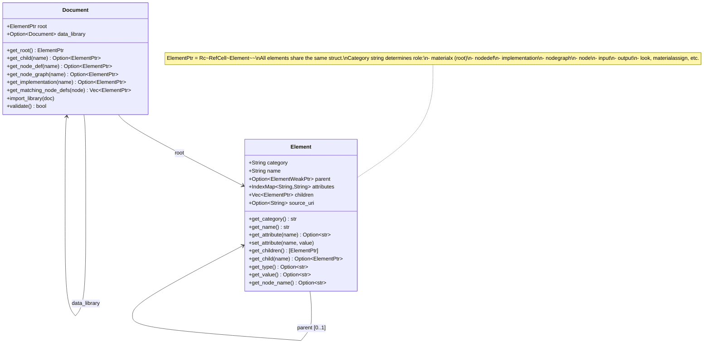
```mermaid
classDiagram
    class Element {
        +String category
        +String name
        +Option~ElementWeakPtr~ parent
        +IndexMap~String,String~ attributes
        +Vec~ElementPtr~ children
        +Option~String~ source_uri
        +get_category() str
        +get_name() str
        +get_attribute(name) Option~str~
        +set_attribute(name, value)
        +get_children() [ElementPtr]
        +get_child(name) Option~ElementPtr~
        +get_type() Option~str~
        +get_value() Option~str~
        +get_node_name() Option~str~
    }

    class Document {
        +ElementPtr root
        +Option~Document~ data_library
        +get_root() ElementPtr
        +get_child(name) Option~ElementPtr~
        +get_node_def(name) Option~ElementPtr~
        +get_node_graph(name) Option~ElementPtr~
        +get_implementation(name) Option~ElementPtr~
        +get_matching_node_defs(node) Vec~ElementPtr~
        +import_library(doc)
        +validate() bool
    }

    Document --> Element : root
    Document --> Document : data_library

    Element --> Element : children [0..*]
    Element --> Element : parent [0..1]

    note for Element "ElementPtr = Rc~RefCell~Element~~\nAll elements share the same struct.\nCategory string determines role:\n- materialx (root)\n- nodedef\n- implementation\n- nodegraph\n- node\n- input\n- output\n- look, materialassign, etc."
```

---

## 3. Shader Generation Pipeline

```mermaid
flowchart TD
    A[".mtlx XML Files"] --> B["read_from_xml_file()"]
    B --> C["Document (Element tree)"]
    C --> D["load_libraries()"]
    D --> E["Document with stdlib NodeDefs"]

    E --> F["Find target Element\n(surfacematerial, output, nodegraph)"]
    F --> G["create_from_element() / create_from_nodegraph()"]

    subgraph Graph Creation
        G --> G1["Resolve NodeDef for element"]
        G1 --> G2["Add input sockets from interface"]
        G2 --> G3["Add output sockets"]
        G3 --> G4["Walk upstream connections"]
        G4 --> G5["For each upstream node:\n- Create ShaderNode\n- Set classification flags\n- Resolve Implementation\n- Connect inputs/outputs"]
        G5 --> G6["Topological sort DAG"]
        G6 --> G7["Finalize: propagate classifications"]
    end

    G7 --> H["ShaderGraph (DAG)"]

    H --> I{"Generator Type?"}

    I -->|HW: GLSL/MSL/Slang| J["hw::create_shader()"]
    I -->|OSL| K["osl_emit::generate()"]
    I -->|MDL| L["mdl_emit::generate()"]

    subgraph HW Shader Creation
        J --> J1["Create vertex + pixel stages"]
        J1 --> J2["Add standard HW uniforms\n(matrices, env, lights)"]
        J2 --> J3["Add geom nodes for defaultgeomprop"]
        J3 --> J4["Populate PUBLIC_UNIFORMS\nfrom input sockets"]
    end

    J4 --> M["Shader (graph + stages)"]

    subgraph Emit Phase
        M --> M1["For each stage:"]
        M1 --> M2["Emit preamble\n(#version, precision, includes)"]
        M2 --> M3["Emit type definitions\n(struct LightData, etc.)"]
        M3 --> M4["Emit variable blocks\n(uniforms, inputs, outputs)"]
        M4 --> M5["For each node in topo order:\nimpl.emit_function_definition()"]
        M5 --> M6["Emit main() {"]
        M6 --> M7["For each node in topo order:\nimpl.emit_function_call()"]
        M7 --> M8["Close main() }"]
        M8 --> M9["Apply token substitutions\n($T_WORLD_MATRIX -> u_worldMatrix)"]
    end

    M9 --> N["Final Shader\n(source_code per stage)"]

    style A fill:#ddf,stroke:#333
    style N fill:#dfd,stroke:#333
    style H fill:#fdd,stroke:#333
```

---

## 4. Generator Class Hierarchy

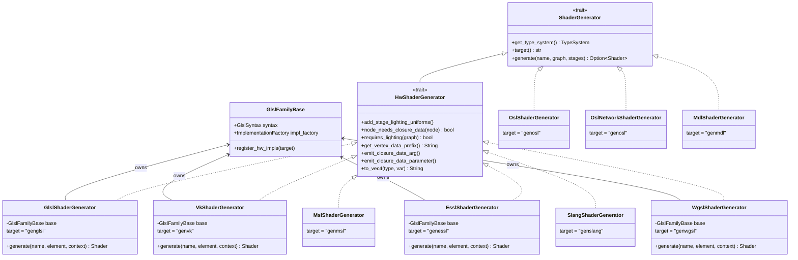
```mermaid
classDiagram
    class ShaderGenerator {
        <<trait>>
        +get_type_system() TypeSystem
        +target() str
        +generate(name, graph, stages) Option~Shader~
    }

    class HwShaderGenerator {
        <<trait>>
        +add_stage_lighting_uniforms()
        +node_needs_closure_data(node) bool
        +requires_lighting(graph) bool
        +get_vertex_data_prefix() String
        +emit_closure_data_arg()
        +emit_closure_data_parameter()
        +to_vec4(type, var) String
    }

    class GlslFamilyBase {
        +GlslSyntax syntax
        +ImplementationFactory impl_factory
        +register_hw_impls(target)
    }

    class GlslShaderGenerator {
        -GlslFamilyBase base
        +generate(name, element, context) Shader
        target = "genglsl"
    }

    class VkShaderGenerator {
        -GlslFamilyBase base
        +generate(name, element, context) Shader
        target = "genvk"
    }

    class EsslShaderGenerator {
        -GlslFamilyBase base
        +generate(name, element, context) Shader
        target = "genessl"
    }

    class WgslShaderGenerator {
        -GlslFamilyBase base
        +generate(name, element, context) Shader
        target = "genwgsl"
    }

    class MslShaderGenerator {
        target = "genmsl"
    }

    class SlangShaderGenerator {
        target = "genslang"
    }

    class OslShaderGenerator {
        target = "genosl"
    }

    class OslNetworkShaderGenerator {
        target = "genosl"
    }

    class MdlShaderGenerator {
        target = "genmdl"
    }

    ShaderGenerator <|-- HwShaderGenerator
    HwShaderGenerator <|.. GlslShaderGenerator
    HwShaderGenerator <|.. VkShaderGenerator
    HwShaderGenerator <|.. EsslShaderGenerator
    HwShaderGenerator <|.. WgslShaderGenerator
    HwShaderGenerator <|.. MslShaderGenerator
    HwShaderGenerator <|.. SlangShaderGenerator
    ShaderGenerator <|.. OslShaderGenerator
    ShaderGenerator <|.. OslNetworkShaderGenerator
    ShaderGenerator <|.. MdlShaderGenerator

    GlslFamilyBase <-- GlslShaderGenerator : owns
    GlslFamilyBase <-- VkShaderGenerator : owns
    GlslFamilyBase <-- EsslShaderGenerator : owns
    GlslFamilyBase <-- WgslShaderGenerator : owns
```

---

## 5. ShaderNodeImpl Hierarchy

```mermaid
classDiagram
    class ShaderNodeImpl {
        <<trait>>
        +get_name() str
        +get_hash() u64
        +initialize(element, context)
        +add_inputs(node, context)
        +add_classification(node)
        +create_variables(node_name, context, shader)
        +emit_function_definition(node, context, stage)
        +emit_function_call(node, context, stage)
        +emit_output_variables(node, context, stage)
        +get_graph() Option~ShaderGraph~
        +is_editable(input) bool
    }

    class NopNode {
        No-op implementation
    }

    class SourceCodeNode {
        +String function_name
        +String function_source
        +bool inlined
        Reads .glsl/.osl/.metal source
    }

    class CompoundNode {
        +ShaderGraph graph
        NodeGraph-based implementation
    }

    class MaterialNode {
        surfacematerial emit
    }

    class HwPositionNode { position }
    class HwNormalNode { normal }
    class HwTangentNode { tangent }
    class HwBitangentNode { bitangent }
    class HwTexCoordNode { texcoord }
    class HwGeomColorNode { geomcolor }
    class HwGeomPropValueNode { geompropvalue }
    class HwViewDirectionNode { viewdirection }
    class HwTransformPointNode { transformpoint }
    class HwTransformVectorNode { transformvector }
    class HwTransformNormalNode { transformnormal }
    class HwSurfaceNode { surface shader }
    class HwLightNode { light }
    class HwFrameNode { frame }
    class HwTimeNode { time }
    class HwImageNode { image (HW) }

    ShaderNodeImpl <|.. NopNode
    ShaderNodeImpl <|.. SourceCodeNode
    ShaderNodeImpl <|.. CompoundNode
    ShaderNodeImpl <|.. MaterialNode
    ShaderNodeImpl <|.. HwPositionNode
    ShaderNodeImpl <|.. HwNormalNode
    ShaderNodeImpl <|.. HwTangentNode
    ShaderNodeImpl <|.. HwBitangentNode
    ShaderNodeImpl <|.. HwTexCoordNode
    ShaderNodeImpl <|.. HwGeomColorNode
    ShaderNodeImpl <|.. HwGeomPropValueNode
    ShaderNodeImpl <|.. HwViewDirectionNode
    ShaderNodeImpl <|.. HwTransformPointNode
    ShaderNodeImpl <|.. HwTransformVectorNode
    ShaderNodeImpl <|.. HwTransformNormalNode
    ShaderNodeImpl <|.. HwSurfaceNode
    ShaderNodeImpl <|.. HwLightNode
    ShaderNodeImpl <|.. HwFrameNode
    ShaderNodeImpl <|.. HwTimeNode
    ShaderNodeImpl <|.. HwImageNode

    note for SourceCodeNode "Default for most nodes.\nReads source from Implementation\nelement's 'file' attribute.\nInlined if no 'function' attr."

    note for CompoundNode "Used when Implementation\nis a NodeGraph.\nRecursively emits sub-graph."
```

---

## 6. Shader Graph DAG Structure

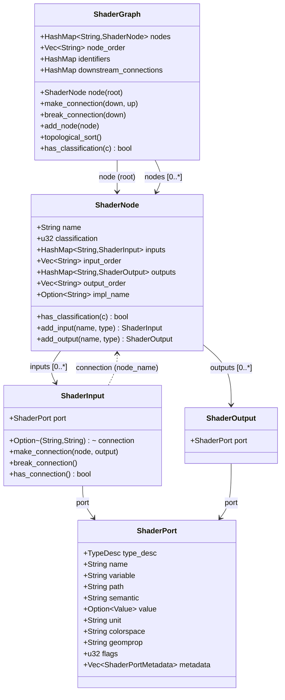
```mermaid
classDiagram
    class ShaderGraph {
        +ShaderNode node (root)
        +HashMap~String,ShaderNode~ nodes
        +Vec~String~ node_order
        +HashMap identifiers
        +HashMap downstream_connections
        +make_connection(down, up)
        +break_connection(down)
        +add_node(node)
        +topological_sort()
        +has_classification(c) bool
    }

    class ShaderNode {
        +String name
        +u32 classification
        +HashMap~String,ShaderInput~ inputs
        +Vec~String~ input_order
        +HashMap~String,ShaderOutput~ outputs
        +Vec~String~ output_order
        +Option~String~ impl_name
        +has_classification(c) bool
        +add_input(name, type) ShaderInput
        +add_output(name, type) ShaderOutput
    }

    class ShaderInput {
        +ShaderPort port
        +Option~(String,String)~ connection
        +make_connection(node, output)
        +break_connection()
        +has_connection() bool
    }

    class ShaderOutput {
        +ShaderPort port
    }

    class ShaderPort {
        +TypeDesc type_desc
        +String name
        +String variable
        +String path
        +String semantic
        +Option~Value~ value
        +String unit
        +String colorspace
        +String geomprop
        +u32 flags
        +Vec~ShaderPortMetadata~ metadata
    }

    ShaderGraph --> ShaderNode : node (root)
    ShaderGraph --> ShaderNode : nodes [0..*]
    ShaderNode --> ShaderInput : inputs [0..*]
    ShaderNode --> ShaderOutput : outputs [0..*]
    ShaderInput --> ShaderPort : port
    ShaderOutput --> ShaderPort : port
    ShaderInput ..> ShaderNode : connection (node_name)
```

---

## 7. Node Classification Bitmask

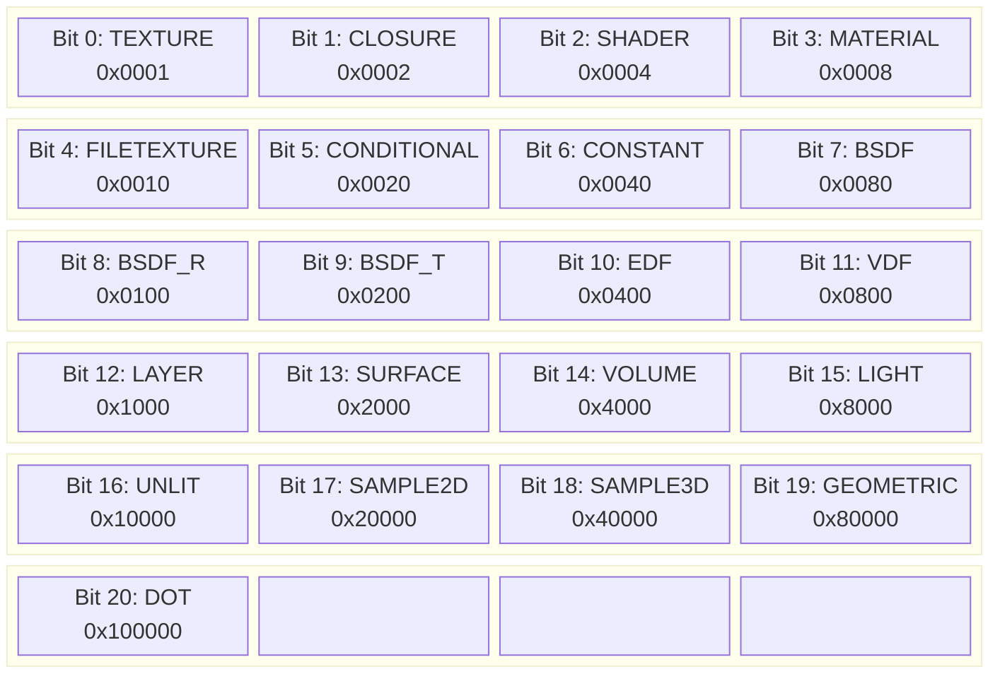
```mermaid
block-beta
    columns 4

    block:group1:4
        columns 4
        a["Bit 0: TEXTURE\n0x0001"]
        b["Bit 1: CLOSURE\n0x0002"]
        c["Bit 2: SHADER\n0x0004"]
        d["Bit 3: MATERIAL\n0x0008"]
    end

    block:group2:4
        columns 4
        e["Bit 4: FILETEXTURE\n0x0010"]
        f["Bit 5: CONDITIONAL\n0x0020"]
        g["Bit 6: CONSTANT\n0x0040"]
        h["Bit 7: BSDF\n0x0080"]
    end

    block:group3:4
        columns 4
        i["Bit 8: BSDF_R\n0x0100"]
        j["Bit 9: BSDF_T\n0x0200"]
        k["Bit 10: EDF\n0x0400"]
        l["Bit 11: VDF\n0x0800"]
    end

    block:group4:4
        columns 4
        m["Bit 12: LAYER\n0x1000"]
        n["Bit 13: SURFACE\n0x2000"]
        o["Bit 14: VOLUME\n0x4000"]
        p["Bit 15: LIGHT\n0x8000"]
    end

    block:group5:4
        columns 4
        q["Bit 16: UNLIT\n0x10000"]
        r["Bit 17: SAMPLE2D\n0x20000"]
        s["Bit 18: SAMPLE3D\n0x40000"]
        t["Bit 19: GEOMETRIC\n0x80000"]
    end

    block:group6:4
        columns 4
        u["Bit 20: DOT\n0x100000"]
        v[" "]
        w[" "]
        x[" "]
    end
```

### Common Classification Combinations

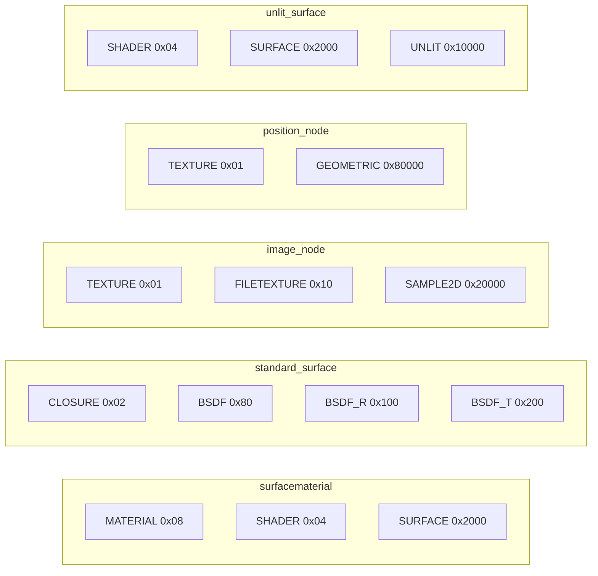
```mermaid
graph LR
    subgraph surfacematerial
        SM_MATERIAL["MATERIAL 0x08"]
        SM_SHADER["SHADER 0x04"]
        SM_SURFACE["SURFACE 0x2000"]
    end

    subgraph standard_surface
        SS_CLOSURE["CLOSURE 0x02"]
        SS_BSDF["BSDF 0x80"]
        SS_BSDF_R["BSDF_R 0x100"]
        SS_BSDF_T["BSDF_T 0x200"]
    end

    subgraph image_node
        IMG_TEXTURE["TEXTURE 0x01"]
        IMG_FILETEX["FILETEXTURE 0x10"]
        IMG_SAMPLE2D["SAMPLE2D 0x20000"]
    end

    subgraph position_node
        POS_TEXTURE["TEXTURE 0x01"]
        POS_GEOMETRIC["GEOMETRIC 0x80000"]
    end

    subgraph unlit_surface
        UL_SHADER["SHADER 0x04"]
        UL_SURFACE["SURFACE 0x2000"]
        UL_UNLIT["UNLIT 0x10000"]
    end
```

---

## 8. Output Shader Structure

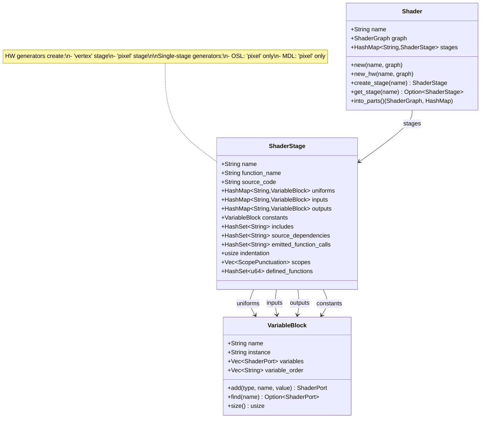
```mermaid
classDiagram
    class Shader {
        +String name
        +ShaderGraph graph
        +HashMap~String,ShaderStage~ stages
        +new(name, graph)
        +new_hw(name, graph)
        +create_stage(name) ShaderStage
        +get_stage(name) Option~ShaderStage~
        +into_parts() (ShaderGraph, HashMap)
    }

    class ShaderStage {
        +String name
        +String function_name
        +String source_code
        +HashMap~String,VariableBlock~ uniforms
        +HashMap~String,VariableBlock~ inputs
        +HashMap~String,VariableBlock~ outputs
        +VariableBlock constants
        +HashSet~String~ includes
        +HashSet~String~ source_dependencies
        +HashSet~String~ emitted_function_calls
        +usize indentation
        +Vec~ScopePunctuation~ scopes
        +HashSet~u64~ defined_functions
    }

    class VariableBlock {
        +String name
        +String instance
        +Vec~ShaderPort~ variables
        +Vec~String~ variable_order
        +add(type, name, value) ShaderPort
        +find(name) Option~ShaderPort~
        +size() usize
    }

    Shader --> ShaderStage : stages
    ShaderStage --> VariableBlock : uniforms
    ShaderStage --> VariableBlock : inputs
    ShaderStage --> VariableBlock : outputs
    ShaderStage --> VariableBlock : constants

    note for ShaderStage "HW generators create:\n- 'vertex' stage\n- 'pixel' stage\n\nSingle-stage generators:\n- OSL: 'pixel' only\n- MDL: 'pixel' only"
```

---

## 9. GenContext and Traits

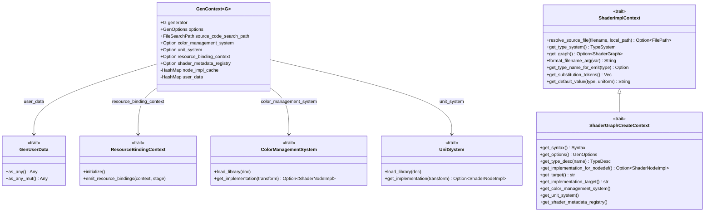
```mermaid
classDiagram
    class GenContext~G~ {
        +G generator
        +GenOptions options
        +FileSearchPath source_code_search_path
        +Option color_management_system
        +Option unit_system
        +Option resource_binding_context
        +Option shader_metadata_registry
        -HashMap node_impl_cache
        -HashMap user_data
    }

    class ShaderImplContext {
        <<trait>>
        +resolve_source_file(filename, local_path) Option~FilePath~
        +get_type_system() TypeSystem
        +get_graph() Option~ShaderGraph~
        +format_filename_arg(var) String
        +get_type_name_for_emit(type) Option
        +get_substitution_tokens() Vec
        +get_default_value(type, uniform) String
    }

    class ShaderGraphCreateContext {
        <<trait>>
        +get_syntax() Syntax
        +get_options() GenOptions
        +get_type_desc(name) TypeDesc
        +get_implementation_for_nodedef() Option~ShaderNodeImpl~
        +get_target() str
        +get_implementation_target() str
        +get_color_management_system()
        +get_unit_system()
        +get_shader_metadata_registry()
    }

    class GenUserData {
        <<trait>>
        +as_any() Any
        +as_any_mut() Any
    }

    class ResourceBindingContext {
        <<trait>>
        +initialize()
        +emit_resource_bindings(context, stage)
    }

    class ColorManagementSystem {
        <<trait>>
        +load_library(doc)
        +get_implementation(transform) Option~ShaderNodeImpl~
    }

    class UnitSystem {
        <<trait>>
        +load_library(doc)
        +get_implementation(transform) Option~ShaderNodeImpl~
    }

    ShaderImplContext <|-- ShaderGraphCreateContext
    GenContext --> GenUserData : user_data
    GenContext --> ResourceBindingContext : resource_binding_context
    GenContext --> ColorManagementSystem : color_management_system
    GenContext --> UnitSystem : unit_system
```

---

## 10. XML I/O Flow

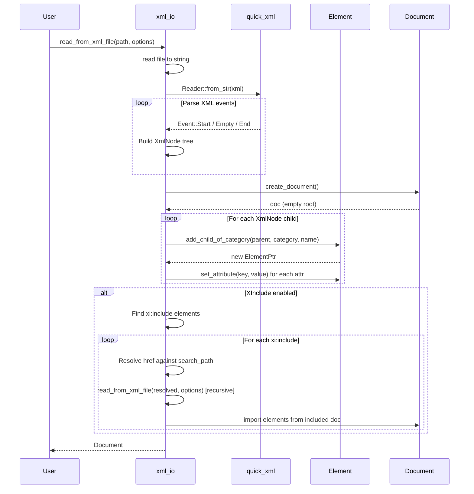
```mermaid
sequenceDiagram
    participant User
    participant xml_io
    participant quick_xml
    participant Element
    participant Document

    User->>xml_io: read_from_xml_file(path, options)
    xml_io->>xml_io: read file to string
    xml_io->>quick_xml: Reader::from_str(xml)

    loop Parse XML events
        quick_xml-->>xml_io: Event::Start / Empty / End
        xml_io->>xml_io: Build XmlNode tree
    end

    xml_io->>Document: create_document()
    Document-->>xml_io: doc (empty root)

    loop For each XmlNode child
        xml_io->>Element: add_child_of_category(parent, category, name)
        Element-->>xml_io: new ElementPtr
        xml_io->>Element: set_attribute(key, value) for each attr
    end

    alt XInclude enabled
        xml_io->>xml_io: Find xi:include elements
        loop For each xi:include
            xml_io->>xml_io: Resolve href against search_path
            xml_io->>xml_io: read_from_xml_file(resolved, options) [recursive]
            xml_io->>Document: import elements from included doc
        end
    end

    xml_io-->>User: Document
```

---

## 11. Type System

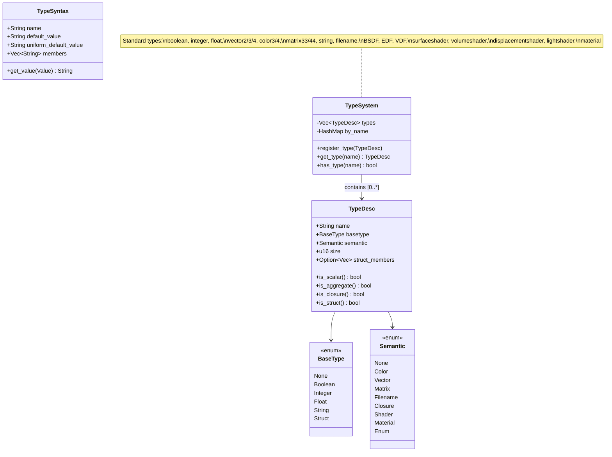
```mermaid
classDiagram
    class TypeDesc {
        +String name
        +BaseType basetype
        +Semantic semantic
        +u16 size
        +Option~Vec~ struct_members
        +is_scalar() bool
        +is_aggregate() bool
        +is_closure() bool
        +is_struct() bool
    }

    class BaseType {
        <<enum>>
        None
        Boolean
        Integer
        Float
        String
        Struct
    }

    class Semantic {
        <<enum>>
        None
        Color
        Vector
        Matrix
        Filename
        Closure
        Shader
        Material
        Enum
    }

    class TypeSystem {
        -Vec~TypeDesc~ types
        -HashMap by_name
        +register_type(TypeDesc)
        +get_type(name) TypeDesc
        +has_type(name) bool
    }

    class TypeSyntax {
        +String name
        +String default_value
        +String uniform_default_value
        +Vec~String~ members
        +get_value(Value) String
    }

    TypeDesc --> BaseType
    TypeDesc --> Semantic
    TypeSystem --> TypeDesc : contains [0..*]

    note for TypeSystem "Standard types:\nboolean, integer, float,\nvector2/3/4, color3/4,\nmatrix33/44, string, filename,\nBSDF, EDF, VDF,\nsurfaceshader, volumeshader,\ndisplacementshader, lightshader,\nmaterial"
```

---

## 12. GLSL Family Architecture

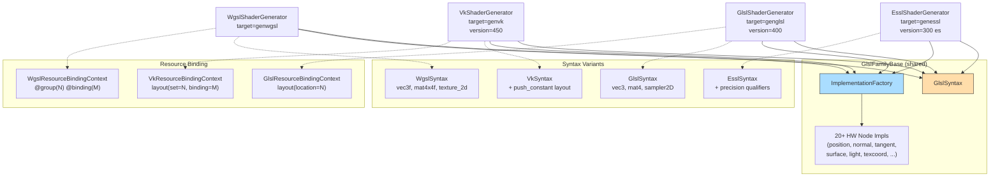
```mermaid
graph TD
    subgraph "GlslFamilyBase (shared)"
        SYNTAX["GlslSyntax"]
        FACTORY["ImplementationFactory"]
        HW_IMPLS["20+ HW Node Impls\n(position, normal, tangent,\nsurface, light, texcoord, ...)"]
    end

    GLSL["GlslShaderGenerator\ntarget=genglsl\nversion=400"]
    VK["VkShaderGenerator\ntarget=genvk\nversion=450"]
    ESSL["EsslShaderGenerator\ntarget=genessl\nversion=300 es"]
    WGSL["WgslShaderGenerator\ntarget=genwgsl"]

    GLSL --> SYNTAX
    GLSL --> FACTORY
    VK --> SYNTAX
    VK --> FACTORY
    ESSL --> SYNTAX
    ESSL --> FACTORY
    WGSL --> SYNTAX
    WGSL --> FACTORY

    FACTORY --> HW_IMPLS

    subgraph "Syntax Variants"
        GLSL_SYN["GlslSyntax\nvec3, mat4, sampler2D"]
        VK_SYN["VkSyntax\n+ push_constant layout"]
        ESSL_SYN["EsslSyntax\n+ precision qualifiers"]
        WGSL_SYN["WgslSyntax\nvec3f, mat4x4f, texture_2d"]
    end

    GLSL -.-> GLSL_SYN
    VK -.-> VK_SYN
    ESSL -.-> ESSL_SYN
    WGSL -.-> WGSL_SYN

    subgraph "Resource Binding"
        GLSL_RBC["GlslResourceBindingContext\nlayout(location=N)"]
        VK_RBC["VkResourceBindingContext\nlayout(set=N, binding=M)"]
        WGSL_RBC["WgslResourceBindingContext\n@group(N) @binding(M)"]
    end

    GLSL -.-> GLSL_RBC
    VK -.-> VK_RBC
    WGSL -.-> WGSL_RBC

    style SYNTAX fill:#fda,stroke:#333
    style FACTORY fill:#adf,stroke:#333
```

---

## 13. Traversal Iterators

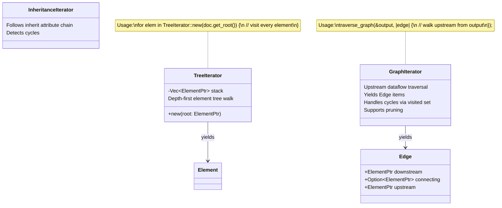
```mermaid
classDiagram
    class TreeIterator {
        -Vec~ElementPtr~ stack
        +new(root: ElementPtr)
        Depth-first element tree walk
    }

    class GraphIterator {
        Upstream dataflow traversal
        Yields Edge items
        Handles cycles via visited set
        Supports pruning
    }

    class InheritanceIterator {
        Follows inherit attribute chain
        Detects cycles
    }

    class Edge {
        +ElementPtr downstream
        +Option~ElementPtr~ connecting
        +ElementPtr upstream
    }

    GraphIterator --> Edge : yields
    TreeIterator --> Element : yields

    note for TreeIterator "Usage:\nfor elem in TreeIterator::new(doc.get_root()) {\n    // visit every element\n}"

    note for GraphIterator "Usage:\ntraverse_graph(&output, |edge| {\n    // walk upstream from output\n});"
```

---

## 14. Bug Hunt Coverage

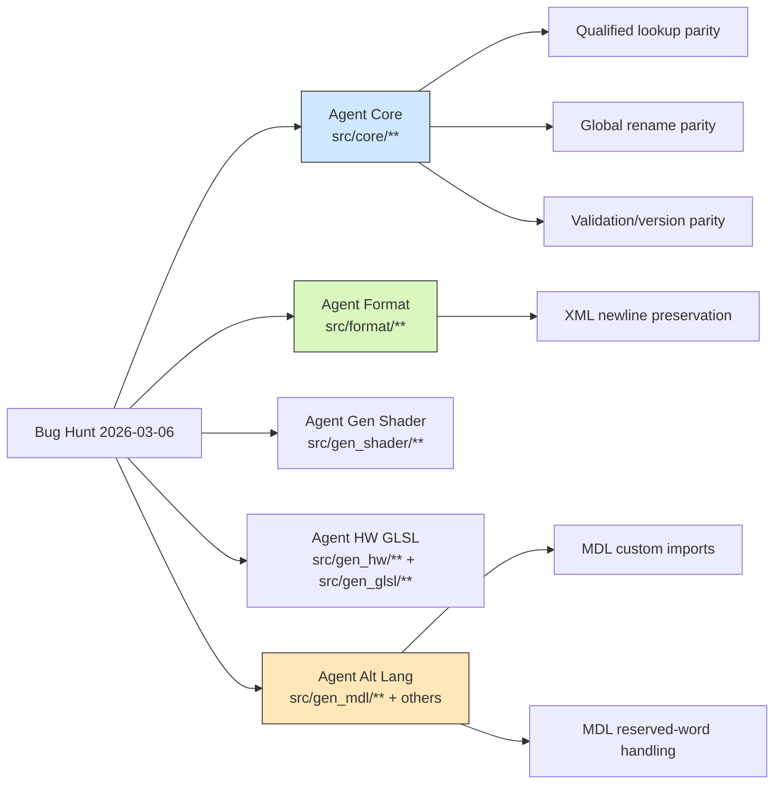
```mermaid
flowchart LR
    PLAN["Bug Hunt 2026-03-06"]

    CORE["Agent Core\nsrc/core/**"]
    FORMAT["Agent Format\nsrc/format/**"]
    GEN["Agent Gen Shader\nsrc/gen_shader/**"]
    HW["Agent HW GLSL\nsrc/gen_hw/** + src/gen_glsl/**"]
    ALT["Agent Alt Lang\nsrc/gen_mdl/** + others"]

    PLAN --> CORE
    PLAN --> FORMAT
    PLAN --> GEN
    PLAN --> HW
    PLAN --> ALT

    CORE --> C1["Qualified lookup parity"]
    CORE --> C2["Global rename parity"]
    CORE --> C3["Validation/version parity"]

    FORMAT --> F1["XML newline preservation"]
    ALT --> A1["MDL custom imports"]
    ALT --> A2["MDL reserved-word handling"]

    style CORE fill:#cfe8ff,stroke:#333
    style FORMAT fill:#d9f7be,stroke:#333
    style ALT fill:#ffe7ba,stroke:#333
```

---

## 15. Qualified Lookup Parity

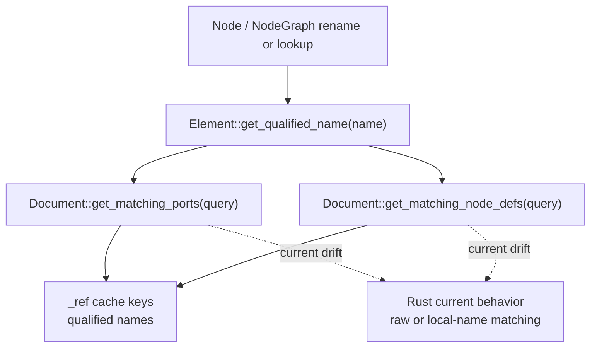
```mermaid
flowchart TD
    NODE["Node / NodeGraph rename or lookup"]
    QUAL["Element::get_qualified_name(name)"]
    DOC_PORTS["Document::get_matching_ports(query)"]
    DOC_DEFS["Document::get_matching_node_defs(query)"]
    CACHE["_ref cache keys\nqualified names"]
    RUST["Rust current behavior\nraw or local-name matching"]

    NODE --> QUAL
    QUAL --> DOC_PORTS
    QUAL --> DOC_DEFS
    DOC_PORTS --> CACHE
    DOC_DEFS --> CACHE

    DOC_PORTS -. current drift .-> RUST
    DOC_DEFS -. current drift .-> RUST
```

---

## 16. XML Read Newline Path

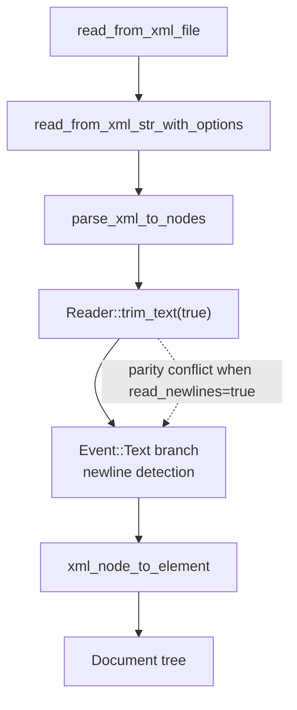
```mermaid
flowchart TD
    FILE["read_from_xml_file"]
    STR["read_from_xml_str_with_options"]
    PARSE["parse_xml_to_nodes"]
    TRIM["Reader::trim_text(true)"]
    TEXT["Event::Text branch\nnewline detection"]
    TREE["xml_node_to_element"]
    DOC["Document tree"]

    FILE --> STR
    STR --> PARSE
    PARSE --> TRIM
    TRIM --> TEXT
    TEXT --> TREE
    TREE --> DOC

    TRIM -. parity conflict when read_newlines=true .-> TEXT
```

---

## 17. MDL Custom Node Emit Path

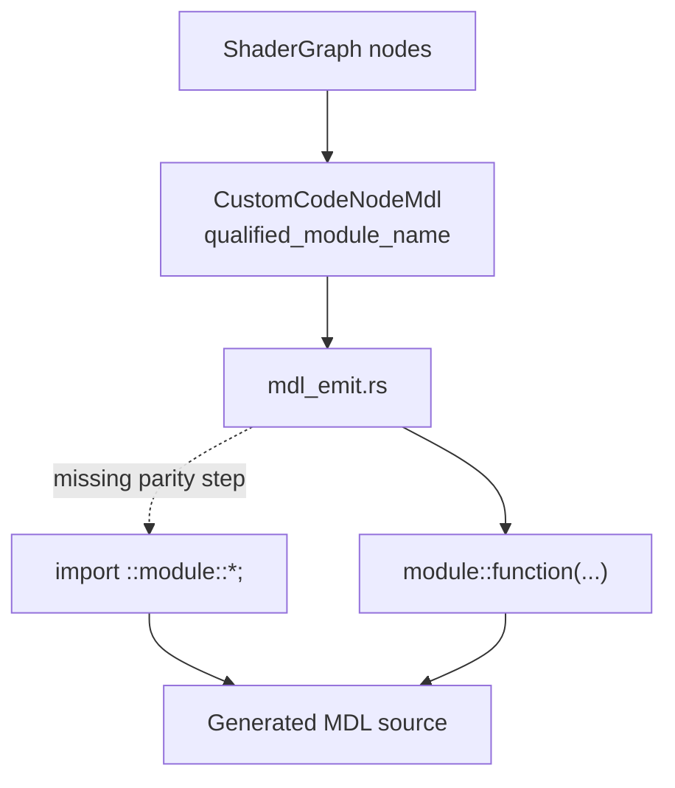
```mermaid
flowchart TD
    GRAPH["ShaderGraph nodes"]
    CUSTOM["CustomCodeNodeMdl\nqualified_module_name"]
    EMIT["mdl_emit.rs"]
    IMPORTS["import ::module::*;"]
    CALLS["module::function(...)"]
    MDL["Generated MDL source"]

    GRAPH --> CUSTOM
    CUSTOM --> EMIT
    EMIT --> CALLS
    EMIT -. missing parity step .-> IMPORTS
    IMPORTS --> MDL
    CALLS --> MDL
```

---

## 18. SourceCodeNode Parity Path

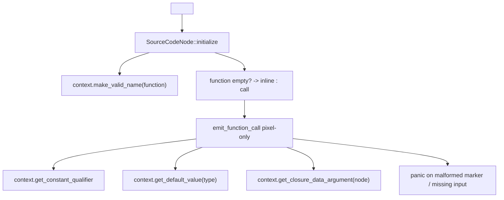
```mermaid
flowchart TD
    IMPL["<implementation>"]
    INIT["SourceCodeNode::initialize"]
    VALID["context.make_valid_name(function)"]
    MODE["function empty? -> inline : call"]
    EMIT["emit_function_call pixel-only"]
    QUAL["context.get_constant_qualifier"]
    DEF["context.get_default_value(type)"]
    CLOSURE["context.get_closure_data_argument(node)"]
    FAIL["panic on malformed marker / missing input"]

    IMPL --> INIT
    INIT --> VALID
    INIT --> MODE
    MODE --> EMIT
    EMIT --> QUAL
    EMIT --> DEF
    EMIT --> CLOSURE
    EMIT --> FAIL
```

---

## 19. MDL SourceCodeNode Return Struct

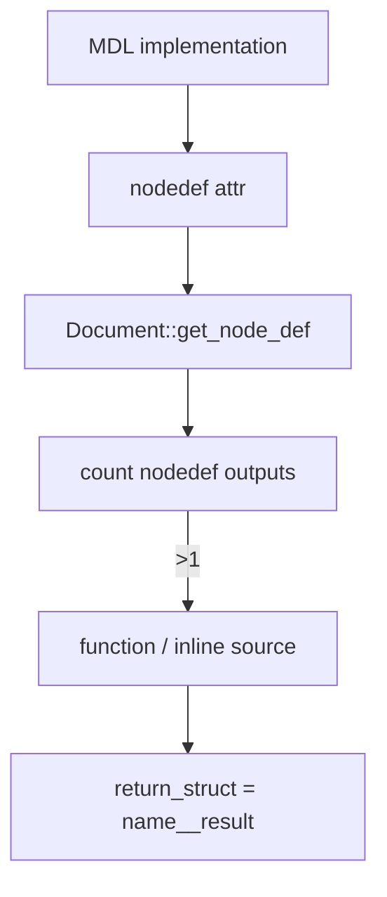
```mermaid
flowchart TD
    IMPL["MDL implementation"]
    NDREF["nodedef attr"]
    DOC["Document::get_node_def"]
    COUNT["count nodedef outputs"]
    FN["function / inline source"]
    STRUCT["return_struct = name__result"]

    IMPL --> NDREF
    NDREF --> DOC
    DOC --> COUNT
    COUNT -->|>1| FN
    FN --> STRUCT
```

---

## 20. Compound Node Rebuild Path

```mermaid
flowchart TD
    IMPL["CompoundNode::initialize"]
    DOC["Document::from_element"]
    REDUCED["ReducedCompoundGraphContext"]
    BUILD["create_shader_graph_from_nodegraph"]
    CHILDREN["resolve_child_impl + emit_child_function_definitions"]
    CALLS["emit_child_function_calls"]
    OUT["compound function body"]

    IMPL --> DOC
    DOC --> REDUCED
    REDUCED --> BUILD
    BUILD --> CHILDREN
    CHILDREN --> CALLS
    CALLS --> OUT
```

---

## 21. Concrete Node Category Entry Path

```mermaid
flowchart LR
    ELEM["Element category = tiledimage / image / multiply / ..."]
    DOC["Document::from_element"]
    GRAPH["ShaderGraph::create_from_element"]
    HW["HW generator generate(...)"]
    EMIT["target emitter"]

    ELEM --> DOC
    DOC --> GRAPH
    GRAPH --> HW
    HW --> EMIT

    OLD["old Rust gate: output | node | nodegraph only"]
    OLD -. removed .-> HW
```

---

## 22. Final Verification Path

```mermaid
flowchart TD
    FIX["Parity fix batch"]
    TARGETED["targeted tests"]
    GOLDEN["glsl_comparison with golden refresh"]
    FULL["cargo test"]
    DONE["crate green"]

    FIX --> TARGETED
    TARGETED --> GOLDEN
    GOLDEN --> FULL
    FULL --> DONE
```
