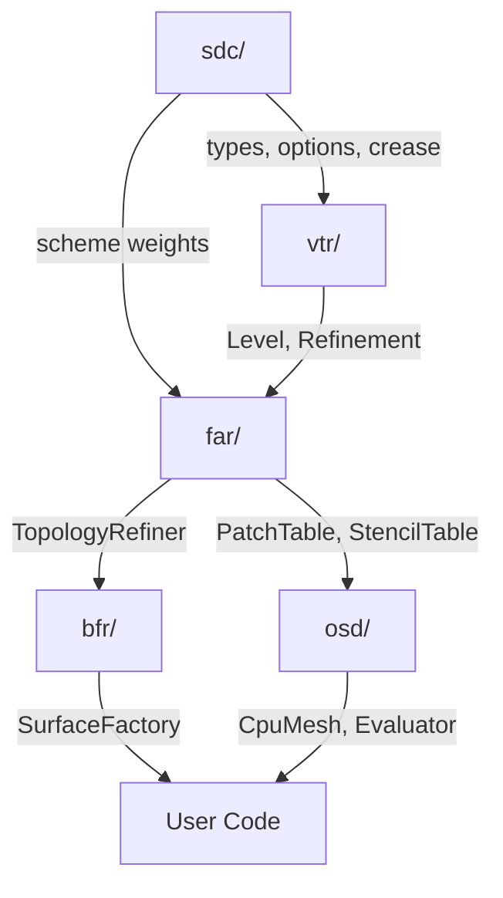

# OpenSubdiv-rs Architecture Diagrams

## Module Dependency Flow



## Subdivision Pipeline


## P0 Bug Impact Map

```mermaid
graph TD
    subgraph "BROKEN: Adaptive Catmark"
        F1[F1: Identity matrices<br/>catmark_patch_builder.rs] -->|wrong basis| CATMARK_EVAL[All Catmark<br/>patch evaluation]
    end

    subgraph "BROKEN: Loop Scheme"
        F2[F2: Wrong limit formula<br/>loop_patch_builder.rs] -->|wrong positions| LOOP_LIMIT[Loop limit<br/>positions]
        F3[F3: Gregory tri stub<br/>loop_patch_builder.rs] -->|wrong patches| LOOP_GREG[Loop Gregory<br/>triangles]
    end

    subgraph "BROKEN: Mesh Output"
        F4[F4: Triangle indices<br/>patch_table_factory.rs] -->|malformed| TRI_MESH[Triangulated<br/>meshes]
    end

    subgraph "BROKEN: Gregory Patches"
        F5[F5: quad_offsets wrong<br/>patch_table.rs] --> GREG_CP[Gregory control<br/>point assembly]
        F6[F6: Gregory unmapped<br/>patch_basis.rs] --> GREG_EVAL[Gregory basis<br/>evaluation]
    end

    subgraph "BROKEN: Limit Surface"
        F7[F7: LimitStencil stub<br/>stencil_table_factory.rs] --> LIMIT[Limit surface<br/>evaluation]
    end

    subgraph "BROKEN: SDC Weights"
        S1[S1: Loop face_weights<br/>loop_scheme.rs] --> LOOP_EDGE[Loop edge<br/>vertex weights]
        S2[S2: Bilinear bypass<br/>bilinear_scheme.rs] --> BILIN[Bilinear<br/>crease handling]
    end

    style F1 fill:#f55,color:#fff
    style F2 fill:#f55,color:#fff
    style F3 fill:#f55,color:#fff
    style F4 fill:#f55,color:#fff
    style F5 fill:#f77,color:#fff
    style F6 fill:#f77,color:#fff
    style F7 fill:#f77,color:#fff
    style S1 fill:#fa5,color:#fff
    style S2 fill:#fa5,color:#fff
```



## Data Flow: Catmark Adaptive Subdivision

```
TopologyDescriptor → TopologyRefinerFactory::create()
    ↓
TopologyRefiner::refine_adaptive()
    ↓ (vtr/Level + vtr/Refinement)
PatchTableFactory::create()
    ↓
  ├─ Regular patches → BSpline 16-point patches
  │   └─ CatmarkPatchBuilder::convert() ← F1: IDENTITY STUB!
  ├─ Gregory patches → 20-point Gregory patches
  │   └─ CatmarkPatchBuilder::convert() ← F1: IDENTITY STUB!
  └─ Uniform patches → Linear quads/tris
      └─ OK (no conversion needed)
    ↓
PatchTable
    ↓
StencilTableFactory::create()  ← F7: LimitStencilTable stub
    ↓
CpuEvaluator::eval_stencils() → refined vertices
CpuEvaluator::eval_patches()  → surface evaluation
```

## Module File Map

```
opensubdiv-rs/src/
├── lib.rs              (VERSION = 3.7.0)
├── sdc/                (~119KB, 8 files)
│   ├── types.rs        SchemeType, Split, SchemeTypeTraits
│   ├── options.rs      Options (boundary, fvar, crease)
│   ├── crease.rs       Crease subdivision logic
│   ├── scheme.rs       Generic Scheme<K> masks
│   ├── bilinear_scheme.rs  BilinearKernel  ← S2: missing bypass
│   ├── catmark_scheme.rs   CatmarkKernel
│   └── loop_scheme.rs      LoopKernel      ← S1: face_weights bug
├── vtr/                (~345KB, 12 files)
│   ├── level.rs        Level topology storage (88KB)
│   ├── refinement.rs   Base Refinement (67KB)
│   ├── quad_refinement.rs  Catmark/Bilinear refinement
│   ├── tri_refinement.rs   Loop refinement
│   ├── fvar_level.rs   Face-varying topology
│   └── fvar_refinement.rs  FVar refinement
├── far/                (~369KB, 23 files) ← MOST BUGS
│   ├── patch_table.rs          ← F5: quad_offsets
│   ├── patch_table_factory.rs  ← F4: triangle indices
│   ├── patch_builder.rs        PatchBuilder base
│   ├── catmark_patch_builder.rs ← F1: IDENTITY MATRICES
│   ├── loop_patch_builder.rs   ← F2,F3,F8: limit/Gregory stubs
│   ├── patch_basis.rs          ← F6: Gregory unmapped
│   ├── stencil_table_factory.rs ← F7: LimitStencil stub
│   ├── topology_refiner.rs     TopologyRefiner
│   └── primvar_refiner.rs      PrimvarRefiner
├── bfr/                (~372KB, 23 files)
│   ├── tessellation.rs  Tessellation (79KB)
│   ├── surface.rs       Surface evaluation
│   ├── surface_factory.rs  SurfaceFactory
│   └── patch_tree.rs   PatchTree lookup
└── osd/                (~155KB, 16 files)
    ├── mesh.rs          CpuMesh           ← O2,O3: missing methods
    ├── cpu_evaluator.rs CpuEvaluator      ← O1: derivative bufs
    ├── cpu_kernel.rs    Stencil/Patch kernels
    └── patch_basis/     Basis evaluation (57KB)
```
