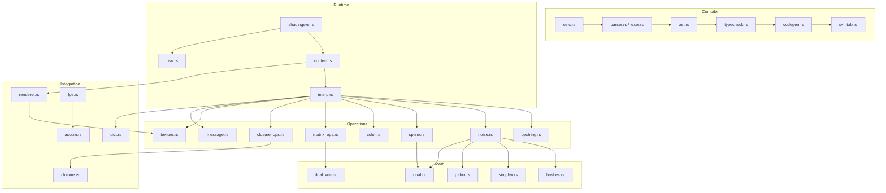
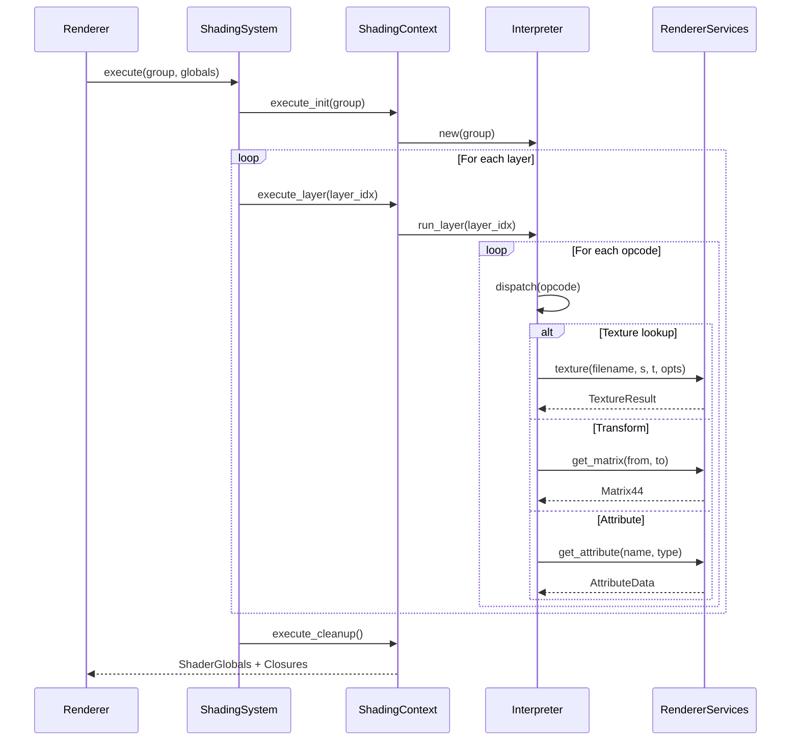
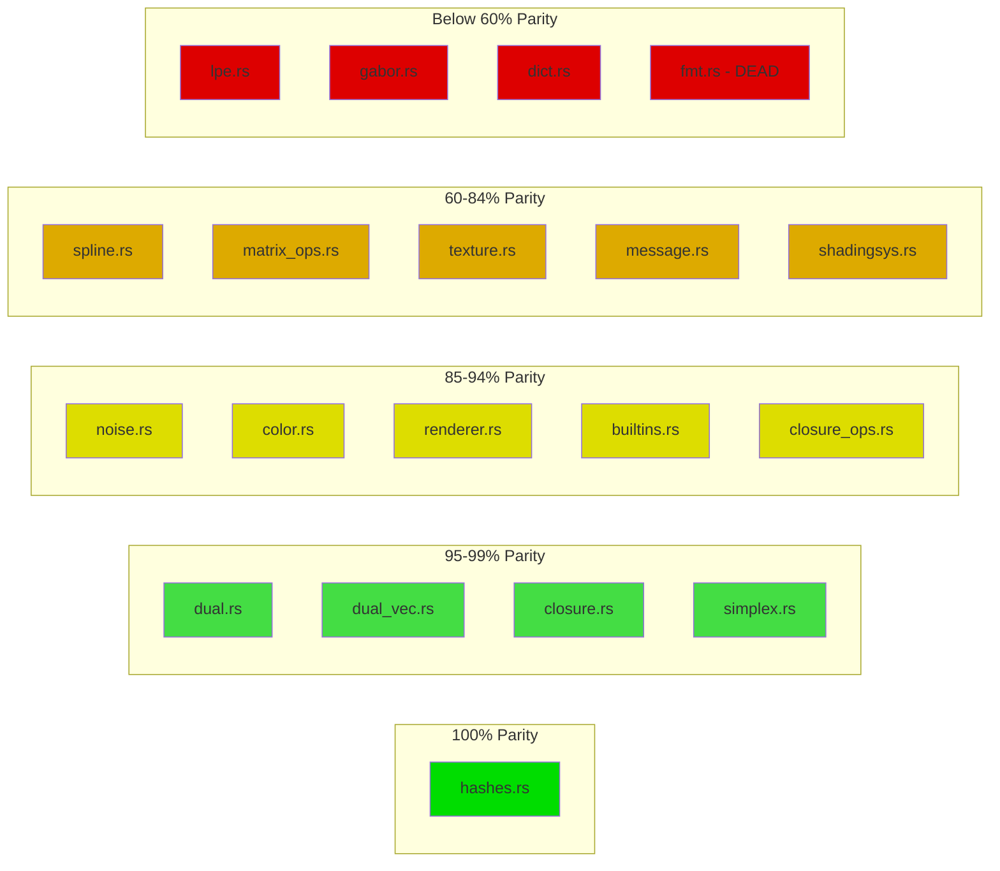
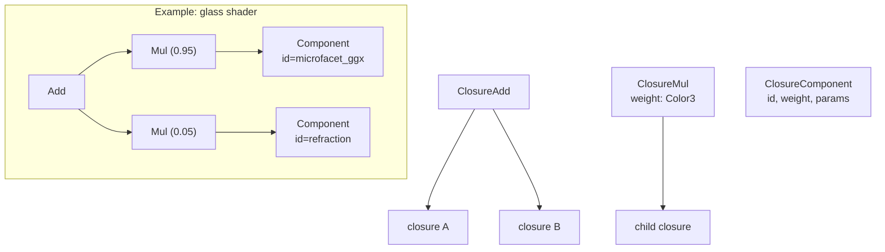
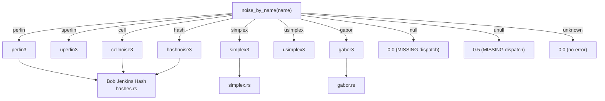
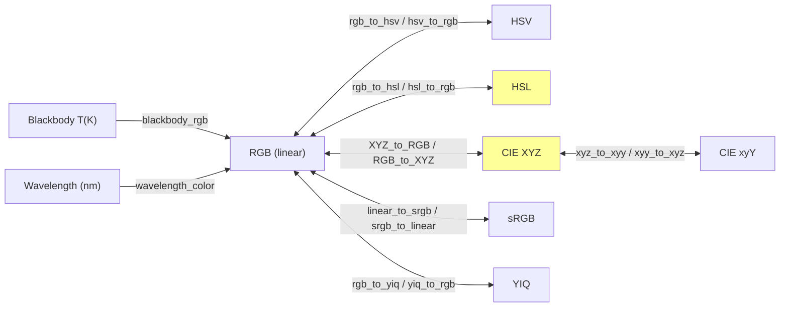

# osl-rs Architecture Diagrams

## 1. Module Dependency Graph

## 2. OSL Compilation Pipeline

```mermaid
flowchart LR
    SRC[".osl source"] --> LEX["Lexer<br/>lexer.rs"]
    LEX --> TOK["Token Stream"]
    TOK --> PAR["Parser<br/>parser.rs"]
    PAR --> AST["AST<br/>ast.rs"]
    AST --> TC["Type Check<br/>typecheck.rs"]
    TC --> TAST["Typed AST"]
    TAST --> CG["CodeGen<br/>codegen.rs"]
    CG --> OSO[".oso bytecode"]
    OSO --> LOAD["OSO Loader<br/>oso.rs"]
    LOAD --> SM["ShaderMaster"]
    SM --> SI["ShaderInstance"]
    SI --> GRP["ShaderGroup"]
```

## 3. Runtime Execution Flow

## 4. Parity Status Heatmap

## 5. Closure Tree Structure

## 6. Noise Type Dispatch

## 7. Color Space Conversion Graph

