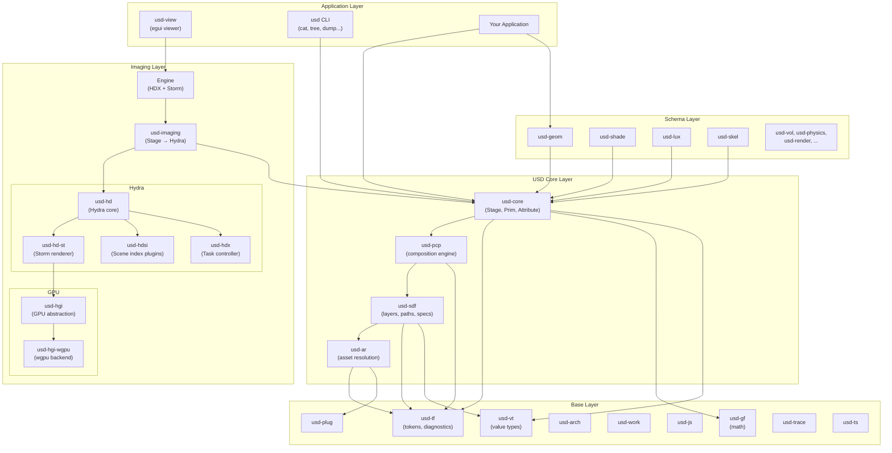
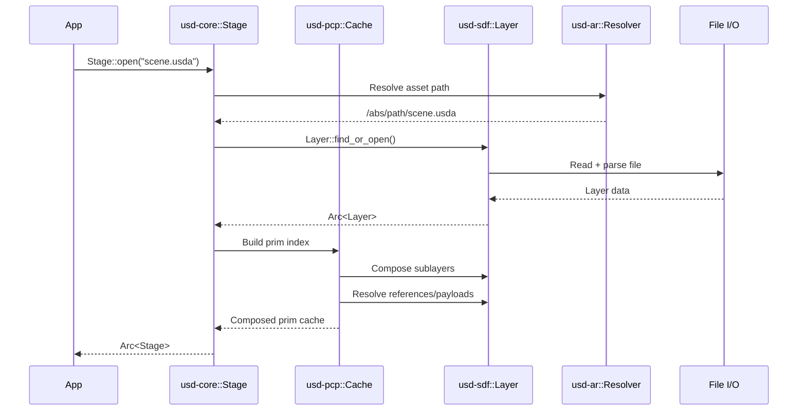

# Architecture Overview

usd-rs mirrors the layered architecture of C++ OpenUSD, organized into four
major tiers: **Base**, **USD Core**, **Schemas**, and **Imaging**.

## High-Level Architecture

## Design Principles

### Pure Rust, No Bindings

Every module is implemented from scratch in Rust. There is no C/C++ dependency,
no FFI layer, and no unsafe code in the core USD pipeline. The C++ OpenUSD
source serves as the behavioral reference, not as linked code.

### Arc-Based Ownership

Stages, layers, and other long-lived objects use `Arc<T>` for shared ownership.
This enables safe multi-threaded access and matches the reference-counted
semantics of the C++ `TfRefPtr`/`SdfLayerRefPtr`.

### Interior Mutability

USD's data model requires mutation through shared references (e.g., setting
attribute values on a composed stage). This is handled through `RwLock` and
`Mutex` where needed, keeping the public API ergonomic.

### Error Propagation

All fallible operations return `Result<T, Error>` instead of panicking or
silently failing. This replaces the C++ pattern of `TF_CODING_ERROR` macros
with idiomatic Rust error handling.

### Token Interning

Frequently-used strings (type names, attribute names, schema tokens) are
interned as `Token` values (from `usd-tf`). Token comparison is O(1) pointer
equality rather than string comparison.

## Key Differences from C++ OpenUSD

| Area | C++ | Rust |
|------|-----|------|
| Memory management | `TfRefPtr`, raw pointers | `Arc<T>`, ownership |
| GPU backend | OpenGL (Storm) | wgpu (Vulkan/Metal/DX12) |
| UI framework | Qt (usdview) | egui (usd-view) |
| Build system | CMake + Boost | Cargo |
| Plugin system | Dynamic `.so`/`.dll` loading | Static registration via `usd-plug` |
| Thread pool | TBB | Rayon + `usd-work` |
| Logging | TF_STATUS/WARN/ERROR | `tracing` + `log` crates |
| Python bindings | Built-in (Boost.Python) | Not yet available |

## Data Flow: Opening a Stage

