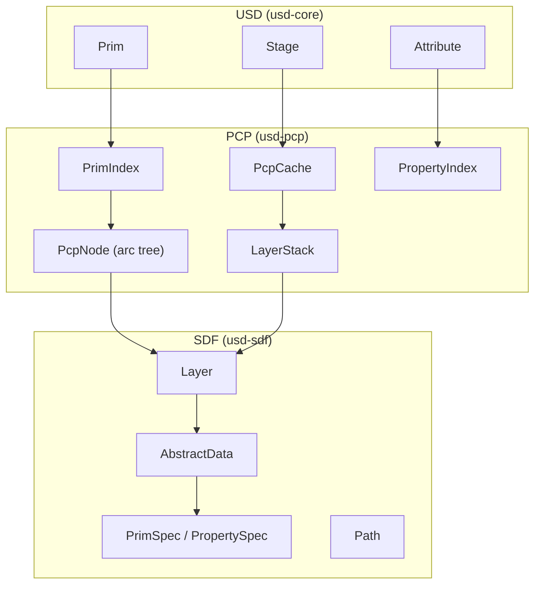
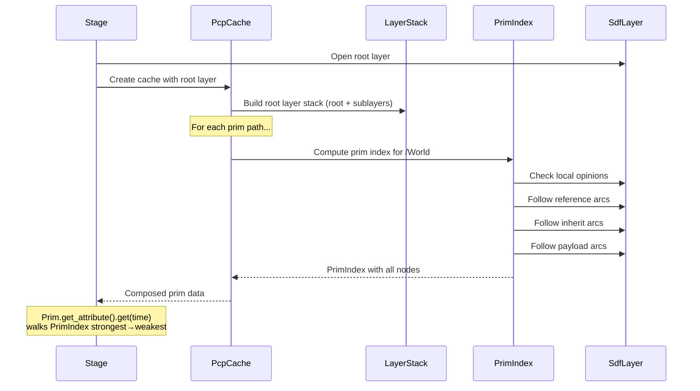
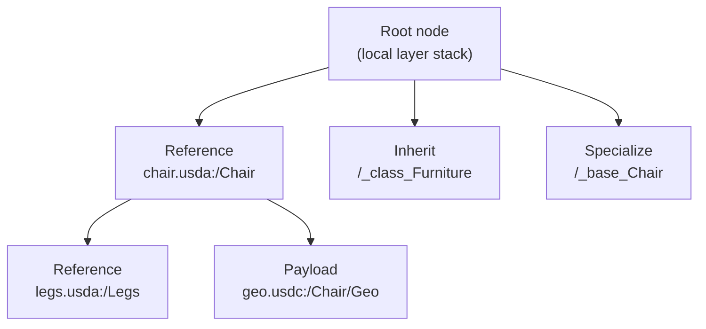

# Composition Engine (SDF / PCP / USD)

The composition engine is the heart of USD. It takes raw layer data (SDF) and
produces a composed view of the scene (USD Stage) through the PCP indexing
process.

## The Three Layers of Composition

### SDF: Scene Description Foundation

SDF is the lowest level. It deals with individual layers and their raw
(un-composed) content:

- **Layer** -- a single file's worth of scene data, stored as a hierarchy of
  specs
- **Spec** -- a namespace entry (PrimSpec, AttributeSpec, RelationshipSpec)
  with fields (key-value pairs)
- **Path** -- a hierarchical name (`/World/Mesh.points`)
- **AbstractData** -- the backing store for spec fields; swappable between
  in-memory hash maps (for USDA) and memory-mapped crate data (for USDC)

SDF does no composition. It only knows about a single layer at a time.

### PCP: Prim Cache Population

PCP is the composition engine. Given a root layer and composition arcs, it
builds a **PrimIndex** for each prim that records all contributing opinions
from all layers, ordered by strength.

Key concepts:

- **PcpCache** -- the main composition cache, one per stage
- **LayerStack** -- an ordered set of sublayers sharing the same composition
  context
- **PrimIndex** -- the composed index for one prim path, containing a tree of
  PcpNodes
- **PcpNode** -- one node in the index tree, representing a single arc
  (reference, payload, inherit, etc.)
- **MapFunction** -- translates paths between different namespace contexts
  (e.g., the path inside a referenced file vs. the path on the stage)

### USD: Composed Stage

The USD layer (`usd-core`) builds on PCP to provide the familiar Stage/Prim
API. It:

1. Maintains a `PcpCache` for composition
2. Populates `PrimData` for each composed prim
3. Resolves attribute values by walking the PrimIndex in strength order
4. Handles instancing, value clips, and schema resolution

## Composition Walk-Through

When you call `Stage::open("scene.usda")`:

## PrimIndex Arc Tree

A PrimIndex is a tree of nodes, one per composition arc:

Each node carries:
- The layer stack contributing opinions
- A map function for path translation
- Arc type (reference, payload, inherit, specialize, variant)
- Permission and restrictions

## Value Resolution

When `Attribute::get(time)` is called:

1. Walk the PrimIndex from strongest to weakest node
2. In each node's layer stack, check each layer (strongest sublayer first)
3. Return the first authored opinion found
4. If no authored opinion, return the schema fallback value

For time-sampled attributes, the resolution also considers:
- Sublayer time offsets (`LayerOffset`)
- Value clips (if authored)
- Interpolation mode (linear or held)

## Instancing

PCP detects **instanceable** prims -- prims whose composition graphs are
structurally identical. These share a single **prototype** PrimIndex, saving
memory and composition time.

The `InstanceCache` in `usd-core` manages the mapping between instance prims
and their shared prototypes. Instance proxies allow traversal into prototype
children through the instance namespace.

## Namespace Editing

PCP supports namespace operations (rename, reparent, remove) that correctly
update all composition arcs referencing the affected paths. The
`PcpNamespaceEdits` module computes the minimal set of layer edits needed to
maintain consistency.

## Change Processing

When a layer is modified, PCP's change processing system:
1. Identifies which PrimIndexes are affected
2. Invalidates stale composition results
3. Recomputes only the affected indices
4. Notifies the Stage via `PcpChanges`

The Stage then updates its PrimData cache and emits USD notices to downstream
consumers (e.g., Hydra).
