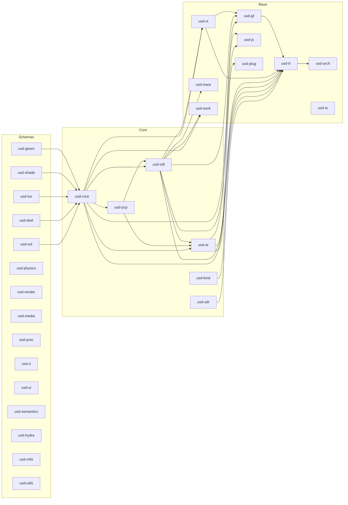

# Crate Map

This chapter maps every crate in the workspace to its C++ OpenUSD counterpart
and describes its role.

## Dependency Graph

## Base Crates (`crates/base/`)

| Crate | C++ Module | Description |
|-------|-----------|-------------|
| `usd-arch` | `pxr/base/arch` | Architecture abstractions: OS detection, CPU info, memory alignment, stack traces, symbol demangling |
| `usd-tf` | `pxr/base/tf` | Tools Foundation: token interning, type registry, diagnostics, debug codes, notifications |
| `usd-gf` | `pxr/base/gf` | Graphics Foundation: vectors, matrices, quaternions, rays, bounding boxes, transforms (backed by `glam`) |
| `usd-vt` | `pxr/base/vt` | Value types: type-erased `Value` container, `VtArray`, type dispatch |
| `usd-js` | `pxr/base/js` | JSON utilities for reading plugin metadata and configuration files |
| `usd-plug` | `pxr/base/plug` | Plugin registry: static plugin discovery and metadata, replaces C++ dynamic loading |
| `usd-trace` | `pxr/base/trace` | Performance tracing and profiling instrumentation |
| `usd-ts` | `pxr/base/ts` | Time splines: animation curve evaluation, knot types, tangent modes |
| `usd-work` | `pxr/base/work` | Work dispatcher: parallel for-each, reduce, and task graphs (wraps Rayon) |

## USD Core Crates (`crates/usd/`)

| Crate | C++ Module | Description |
|-------|-----------|-------------|
| `usd-ar` | `pxr/usd/ar` | Asset Resolution: `ArResolver`, `ArResolvedPath`, `ArResolverContext`, `DispatchingResolver`, filesystem and package asset implementations |
| `usd-sdf` | `pxr/usd/sdf` | Scene Description Foundation: `Layer`, `Path`, `Spec`, value types, USDA parser, USDC reader, USDZ resolver, Alembic reader, change notification |
| `usd-pcp` | `pxr/usd/pcp` | Prim Cache Population: composition engine, `PrimIndex`, `LayerStack`, arc traversal, instancing detection, namespace editing |
| `usd-core` | `pxr/usd/usd` | Core USD: `Stage`, `Prim`, `Attribute`, `Relationship`, `Property`, edit targets, schema registry, value clips, instance cache |
| `usd-kind` | `pxr/usd/kind` | Kind registry: model hierarchy classification (component, group, assembly, subcomponent) |
| `usd-sdr` | `pxr/usd/sdr` | Shader Definition Registry: shader node discovery and metadata |
| `usd-derive-macros` | -- | Proc-macro crate for schema and token derive macros |

## Schema Crates (`crates/usd/`)

| Crate | C++ Module | Description |
|-------|-----------|-------------|
| `usd-geom` | `pxr/usd/usdGeom` | Geometry: Mesh, BasisCurves, Points, Xform, Camera, implicit surfaces, BBoxCache, XformCache, Primvars |
| `usd-shade` | `pxr/usd/usdShade` | Shading: Material, Shader, Input, Output, ConnectableAPI, MaterialBindingAPI, CoordSysAPI |
| `usd-lux` | `pxr/usd/usdLux` | Lighting: all light types, shadow linking, light filters |
| `usd-skel` | `pxr/usd/usdSkel` | Skeletal animation: Skeleton, SkelAnimation, BlendShape, skinning |
| `usd-hydra` | `pxr/usd/usdHydra` | Hydra interop schemas |
| `usd-media` | `pxr/usd/usdMedia` | Media: SpatialAudio |
| `usd-mtlx` | `pxr/usd/usdMtlx` | MaterialX integration schemas |
| `usd-physics` | `pxr/usd/usdPhysics` | Rigid body physics: joints, collision, mass |
| `usd-proc` | `pxr/usd/usdProc` | Procedural generation schemas |
| `usd-render` | `pxr/usd/usdRender` | Render settings, products, vars |
| `usd-ri` | `pxr/usd/usdRi` | RenderMan-specific schemas |
| `usd-semantics` | `pxr/usd/usdSemantics` | Semantic labels and taxonomies |
| `usd-ui` | `pxr/usd/usdUI` | UI schemas: backdrops, node graph hints |
| `usd-utils` | `pxr/usd/usdUtils` | Utilities: flattening, stitching, dependency analysis |
| `usd-vol` | `pxr/usd/usdVol` | Volumetric data schemas |

## Imaging Crates (`crates/imaging/`)

| Crate | C++ Module | Description |
|-------|-----------|-------------|
| `usd-camera-util` | `pxr/imaging/cameraUtil` | Camera framing, conformance, screen-window utilities |
| `usd-geom-util` | `pxr/imaging/geomUtil` | Geometry synthesis for implicit shapes (cube, sphere, cylinder, cone, capsule, plane) |
| `usd-px-osd` | `pxr/imaging/pxOsd` | OpenSubdiv integration: subdivision surface topology and refinement |
| `usd-hio` | `pxr/imaging/hio` | Hydra image I/O: texture loading, image format support |
| `usd-hf` | `pxr/imaging/hf` | Hydra Foundation: plugin system for render delegates |
| `usd-hgi` | `pxr/imaging/hgi` | Hydra Graphics Interface: GPU abstraction (buffers, textures, pipelines, commands) |
| `usd-hgi-wgpu` | -- | wgpu backend for HGI (replaces C++ HgiGL/HgiVulkan/HgiMetal) |
| `usd-hgi-interop` | `pxr/imaging/hgiInterop` | Interop between HGI backends |
| `usd-hgi-metal` | `pxr/imaging/hgiMetal` | Metal backend stubs |
| `usd-hgi-vulkan` | `pxr/imaging/hgiVulkan` | Vulkan backend stubs |
| `usd-glf` | `pxr/imaging/glf` | GL Foundation: texture utilities, diagnostics |
| `usd-hd` | `pxr/imaging/hd` | Hydra core: render index, scene delegate/index, data sources, material networks, draw items, selections |
| `usd-hd-st` | `pxr/imaging/hdSt` | Storm renderer: draw batching, shader generation, GPU resource management |
| `usd-hdsi` | `pxr/imaging/hdsi` | Scene index plugins: flattening, material, nurbsCurves, tetMesh, etc. |
| `usd-hdar` | `pxr/imaging/hdar` | Hydra asset resolution adapter |
| `usd-hd-gp` | `pxr/imaging/hdGp` | Hydra generative procedurals |
| `usd-hd-mtlx` | `pxr/imaging/hdMtlx` | Hydra MaterialX adapter |
| `usd-hdx` | `pxr/imaging/hdx` | Task controller: render tasks, AOV management, selection, color correction |
| `usd-app-utils` | `pxr/imaging/usdAppUtils` | Application utilities: frame recording, camera utilities |

## Top-Level Crates

| Crate | C++ Module | Description |
|-------|-----------|-------------|
| `usd-imaging` | `pxr/usdImaging` | USD-to-Hydra bridge: StageSceneIndex, prim adapters, rendering engine |
| `usd-validation` | `pxr/usd/usdValidation` | Validation framework: validator plugins, compliance rules |
| `usd-view` | `pxr/usdview` (Python) | Interactive viewer: egui-based UI, viewport, hierarchy browser, attribute editor |

## External Crates (`crates/ext/`)

| Crate | Description |
|-------|-------------|
| `draco-rs` | Pure Rust port of Google Draco mesh compression |
| `gltf-rs` | glTF 2.0 loader and data model |
| `mtlx-rs` | Pure Rust port of MaterialX |
| `opensubdiv-rs` | Pure Rust port of OpenSubdiv for subdivision surfaces |
| `osl-rs` | Pure Rust port of OpenShadingLanguage (shader compiler) |
| `pxr-lz4` | LZ4 decompression compatible with OpenUSD TfFastCompression |
