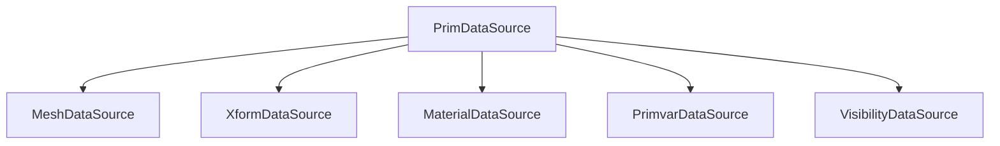
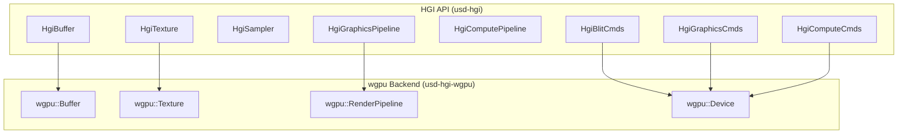

# Hydra and Imaging

Hydra is the rendering architecture that connects scene data to GPU renderers.
In usd-rs, the imaging pipeline translates composed USD data into Hydra prims
and feeds them to the Storm render delegate.

## Imaging Pipeline Overview

```mermaid
graph LR
    subgraph "Scene Data"
        Stage["USD Stage"]
    end

    subgraph "USD Imaging"
        SSI["StageSceneIndex"]
        Adapters["Prim Adapters"]
    end

    subgraph "Hydra Core (usd-hd)"
        RI["RenderIndex"]
        SI["Scene Index Chain"]
        RD["Render Delegate"]
    end

    subgraph "Storm (usd-hd-st)"
        Batch["Draw Batching"]
        Shader["Shader Gen"]
        GPU["GPU Resources"]
    end

    subgraph "HGI"
        HGI_API["HGI API"]
        WGPU["wgpu Backend"]
    end

    Stage --> SSI
    SSI --> Adapters
    Adapters --> SI
    SI --> RI
    RI --> RD
    RD --> Batch
    Batch --> Shader
    Shader --> GPU
    GPU --> HGI_API
    HGI_API --> WGPU
```



## Key Components

### StageSceneIndex (`usd-imaging`)

The entry point that wraps a USD Stage and exposes it as a Hydra scene index.
It uses **prim adapters** to translate USD prim types into Hydra
representations:

| USD Type | Hydra Rprim | Adapter |
|----------|-------------|---------|
| Mesh | HdMesh | MeshAdapter |
| BasisCurves | HdBasisCurves | BasisCurvesAdapter |
| Points | HdPoints | PointsAdapter |
| Cube, Sphere, ... | HdMesh (synthesized) | ImplicitSurfaceAdapter |
| Camera | HdCamera (sprim) | CameraAdapter |
| Light types | HdLight (sprim) | LightAdapter |
| Material | HdMaterial (sprim) | MaterialAdapter |
| Volume | HdVolume | VolumeAdapter |
| PointInstancer | HdInstancer | PointInstancerAdapter |

### RenderIndex (`usd-hd`)

The central registry of all Hydra prims. It maintains:
- **Rprims** -- renderable primitives (meshes, curves, points)
- **Sprims** -- state prims (cameras, lights, materials, render settings)
- **Bprims** -- buffer prims (render buffers, AOV textures)

### Render Delegate (`usd-hd`)

The interface between Hydra and a specific renderer. Storm (`usd-hd-st`) is the
built-in rasterizer. The delegate creates GPU resources, manages draw batching,
and executes render passes.

### Task Controller (`usd-hdx`)

Manages the ordered sequence of render tasks:
1. **Render task** -- draw geometry
2. **AOV input** -- resolve AOV textures
3. **Selection colorize** -- highlight selected prims
4. **Color correction** -- apply OCIO / gamma
5. **Present** -- output to screen

### Engine (`usd-imaging`)

The application-facing renderer that orchestrates the full pipeline:

```rust
// Simplified engine usage (internal to usd-view)
let engine = Engine::new(stage, &renderer_plugin);
engine.set_render_viewport(rect);
engine.set_camera_state(&camera);
engine.render(params);
```

## Hydra Data Sources

The modern Hydra architecture uses **data sources** instead of the older scene
delegate callbacks. A data source is a lazy, hierarchical data provider:



Each data source provides typed containers and sampled values on demand,
avoiding eager computation of unused data.

### Data Source Traits

```rust
// Core trait for providing scene data
pub trait ContainerDataSource: Send + Sync {
    fn get_names(&self) -> Vec<Token>;
    fn get(&self, name: &Token) -> Option<Arc<dyn DataSource>>;
}

// Trait for time-sampled values
pub trait SampledDataSource<T>: Send + Sync {
    fn get_value(&self, shutter_offset: f32) -> Option<T>;
    fn get_contribution(&self) -> Option<T>;
}
```

## GPU Abstraction (HGI)

HGI (Hydra Graphics Interface) provides a renderer-agnostic GPU API:



The wgpu backend (`usd-hgi-wgpu`) maps HGI operations to wgpu API calls,
providing cross-platform GPU support via Vulkan, Metal, DX12, and WebGPU.

## Storm Renderer (`usd-hd-st`)

Storm is the high-performance rasterizer:

- **Draw batching** -- groups compatible draw items to minimize state changes
- **Shader generation** -- produces GLSL/WGSL shaders from material networks
- **Resource management** -- buffer arrays, texture atlases, uniform blocks
- **Subdivision** -- integrates with OpenSubdiv for Catmull-Clark surfaces
- **Selection** -- GPU-based picking and selection highlighting
