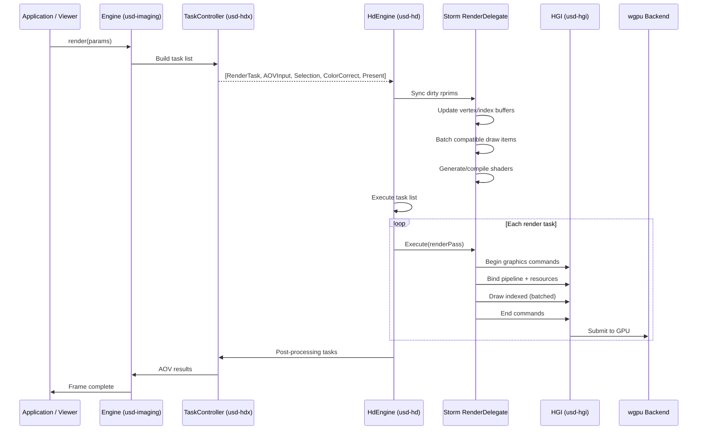
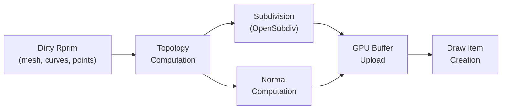
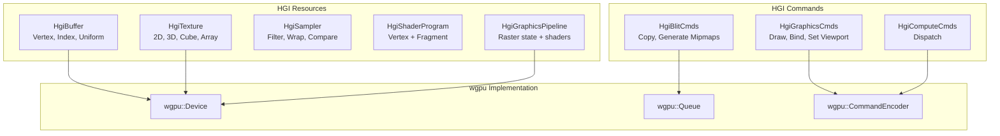
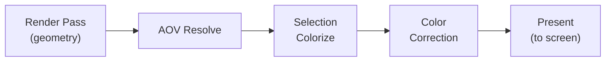
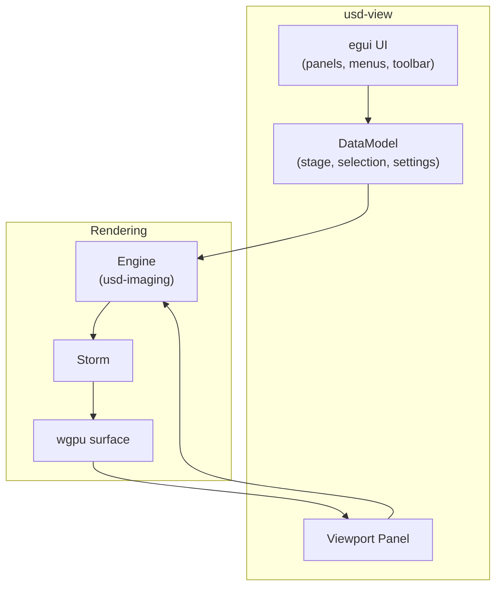

# Render Pipeline (Storm / wgpu)

This chapter describes how geometry flows from Hydra through Storm to the GPU
via the wgpu backend.

## Full Render Frame

## Storm Draw Pipeline

### Rprim Sync

When the render index has dirty rprims, Storm syncs them to GPU:

For each mesh:
1. **Topology** -- face vertex counts, indices, subdivision scheme
2. **Subdivision** -- if scheme is `catmullClark`, refine via OpenSubdiv
3. **Normals** -- compute smooth or flat normals if not authored
4. **Upload** -- transfer vertex/index data to GPU buffers via HGI
5. **Draw Item** -- create a draw item with material binding, transform, visibility

### Draw Batching

Storm groups draw items by compatible state to minimize GPU state changes:

| Batch key | Components |
|-----------|-----------|
| Shader program | Material network hash |
| Geometry | Buffer array range |
| Pipeline state | Blend mode, depth test, cull face |
| Render pass | AOV target set |

Batched items are drawn with a single `draw_indexed` call using instanced
rendering or multi-draw-indirect where supported.

### Shader Generation

Storm generates shaders dynamically based on:
- Material network (UsdPreviewSurface parameters)
- Geometry type (mesh, curves, points)
- Lighting configuration
- AOV requirements (color, depth, ID, normals)
- Selection highlighting

## HGI Abstraction Layer

HGI provides a portable GPU API. Key abstractions:

### wgpu Backend (`usd-hgi-wgpu`)

The wgpu backend maps HGI operations to the wgpu API:

| HGI Operation | wgpu Equivalent |
|--------------|-----------------|
| `CreateBuffer` | `device.create_buffer()` |
| `CreateTexture` | `device.create_texture()` |
| `CreateGraphicsPipeline` | `device.create_render_pipeline()` |
| `GraphicsCmds::Draw` | `render_pass.draw_indexed()` |
| `BlitCmds::CopyBufferToBuffer` | `encoder.copy_buffer_to_buffer()` |
| `SubmitCmds` | `queue.submit()` |

wgpu automatically selects the best available GPU backend:
- **Windows**: Vulkan or DX12
- **macOS**: Metal
- **Linux**: Vulkan
- **Web**: WebGPU

## AOV (Arbitrary Output Variable) Pipeline

Storm renders to multiple output targets simultaneously:

| AOV | Content | Usage |
|-----|---------|-------|
| `color` | Final shaded color | Display |
| `depth` | Z-buffer depth | Post-effects, compositing |
| `primId` | Prim identifier | GPU picking |
| `instanceId` | Instance identifier | Instance picking |
| `elementId` | Face/edge identifier | Sub-element picking |
| `normal` | World-space normals | Visualization |

The task controller (`usd-hdx`) manages AOV resolution and post-processing:

## Viewer Integration (`usd-view`)

The viewer uses egui for the UI and wgpu for rendering:

The viewer provides:
- Interactive orbit/pan/zoom camera
- Prim hierarchy browser with filtering
- Attribute inspector with time-sample editing
- Timeline with playback controls
- Renderer settings (complexity, AOV display, material mode)
- GPU picking for selection
- HUD overlay with performance statistics
