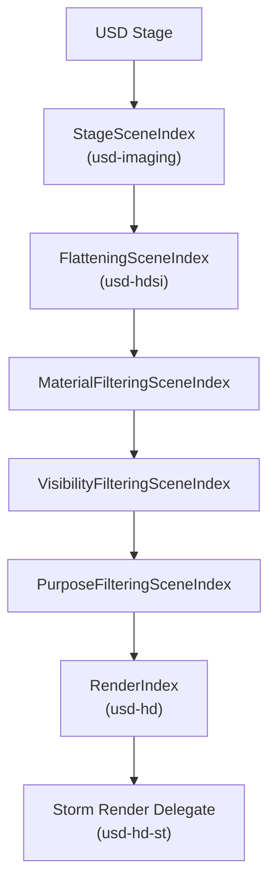
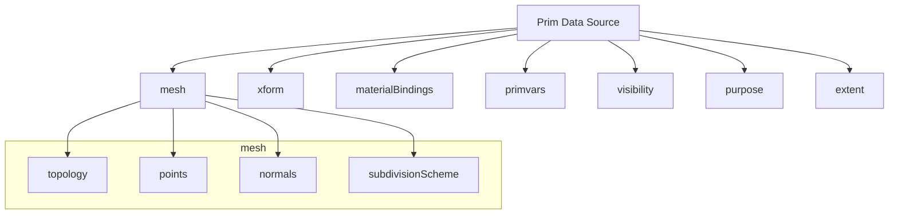
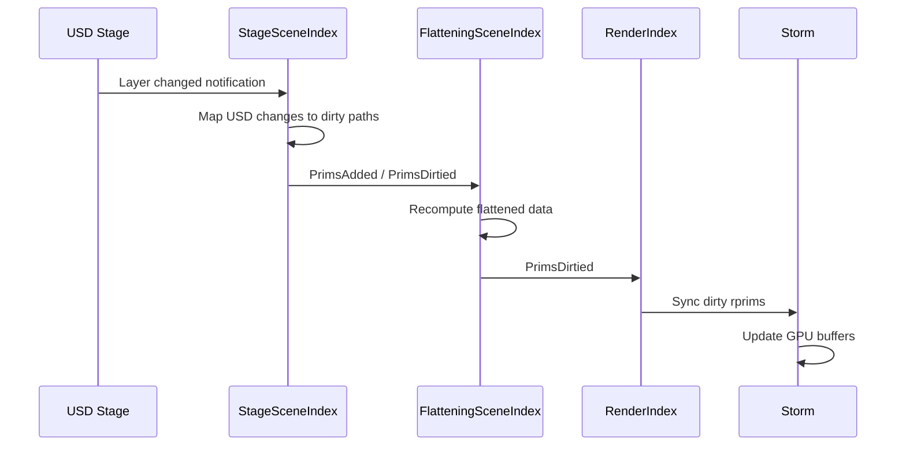

# Scene Index Pipeline

The scene index is the modern Hydra data flow architecture. It replaces the
older scene delegate pattern with a composable chain of filtering and
transforming scene indices.

## Scene Index Chain



Each scene index in the chain can:
- **Add** prims (e.g., synthesize implicit geometry)
- **Remove** prims (e.g., filter by visibility or purpose)
- **Transform** prim data (e.g., flatten inherited transforms)
- **Override** data sources (e.g., resolve material bindings)

## How Scene Indices Work

A scene index implements three core operations:

| Method | Purpose |
|--------|---------|
| `get_prim(path)` | Return the prim type and data source for a path |
| `get_child_prim_paths(path)` | Return the children of a path |
| `notify(added, removed, dirtied)` | Propagate change notifications downstream |

### Filtering Scene Index

A filtering scene index wraps an upstream (input) scene index and modifies its
output:


## Standard Scene Index Plugins (`usd-hdsi`)

| Plugin | Description |
|--------|-------------|
| `FlatteningSceneIndex` | Flattens inherited transforms, visibility, purpose, and material bindings down the hierarchy |
| `MaterialFilteringSceneIndex` | Resolves material binding relationships into concrete material data |
| `PrimvarsDataSourceProvider` | Provides flattened primvar data with correct interpolation |
| `VisibilityDataSourceProvider` | Computes resolved visibility (inheriting from ancestors) |
| `PurposeDataSourceProvider` | Computes resolved purpose (default, render, proxy, guide) |
| `XformDataSourceProvider` | Computes world-space transforms from local xformOps |
| `NurbsCurvesSceneIndex` | Converts NURBS curves to basis curves for rendering |
| `TetMeshConversionSceneIndex` | Converts tetrahedral meshes to surface meshes |

## Data Source Architecture

Each prim in a scene index exposes its data through a tree of **data sources**:



Data sources are lazy -- they compute values only when requested. This avoids
pulling heavy geometry data for prims that are culled or not visible.

### Typed Data Sources

usd-rs uses generic typed data sources for type-safe access:

```rust
// A sampled data source that provides Vec3f[] points
pub struct PointsDataSource {
    stage: Arc<Stage>,
    path: Path,
}

impl SampledDataSource<VtArray<GfVec3f>> for PointsDataSource {
    fn get_value(&self, shutter_offset: f32) -> Option<VtArray<GfVec3f>> {
        // Read from USD attribute at the given time
        let time = TimeCode::from(shutter_offset as f64);
        let prim = self.stage.get_prim_at_path(&self.path);
        let attr = prim.get_attribute(&"points".into())?;
        attr.get_typed(time)
    }
}
```

## Change Propagation

When USD data changes (e.g., an attribute is edited, a layer is reloaded),
the change propagates through the scene index chain:



## Adding a Custom Scene Index

To inject custom behavior into the pipeline, implement a filtering scene index:

```rust
use usd::imaging::hd::scene_index::*;

pub struct MyFilterSceneIndex {
    input: Arc<dyn SceneIndex>,
}

impl SceneIndex for MyFilterSceneIndex {
    fn get_prim(&self, path: &Path) -> SceneIndexPrim {
        let mut prim = self.input.get_prim(path);
        // Modify prim data source as needed
        prim
    }

    fn get_child_prim_paths(&self, path: &Path) -> Vec<Path> {
        self.input.get_child_prim_paths(path)
    }
}
```

## Scene Index vs Scene Delegate

| Aspect | Scene Delegate (legacy) | Scene Index (modern) |
|--------|------------------------|---------------------|
| Data flow | Pull-based callbacks | Push-based data sources |
| Composability | Monolithic | Chainable filters |
| Change tracking | Dirty bits | Fine-grained notifications |
| Lazy evaluation | Limited | Full (data sources) |
| Used by | Legacy code paths | New development |

usd-rs implements both patterns for compatibility, but new code should use the
scene index approach exclusively.
