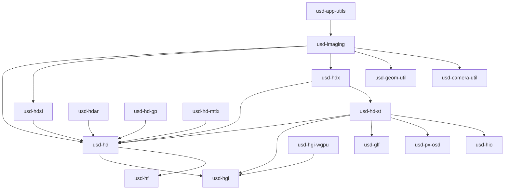

# Imaging Crates

The imaging crates implement the Hydra rendering architecture, GPU abstraction,
and rendering utilities. They correspond to `pxr/imaging/` in C++ OpenUSD.

## Dependency Graph

## Utility Crates

### usd-camera-util

Camera framing and conformance utilities.

| Feature | Description |
|---------|-------------|
| `ConformWindowPolicy` | Fit, crop, or match viewport to camera |
| `ScreenWindowParameters` | Compute screen-space window from camera |
| `FrameComputation` | Camera framing from bounding boxes |

### usd-geom-util

Geometry synthesis for implicit shapes. Generates mesh topology and points for:

| Shape | Function |
|-------|----------|
| Cube | `MeshGeneratorCube` |
| Sphere | `MeshGeneratorSphere` |
| Cylinder | `MeshGeneratorCylinder` |
| Cone | `MeshGeneratorCone` |
| Capsule | `MeshGeneratorCapsule` |
| Plane | `MeshGeneratorPlane` |

### usd-px-osd

OpenSubdiv integration for subdivision surface refinement.

| Feature | Description |
|---------|-------------|
| Topology conversion | USD mesh → OpenSubdiv topology |
| Refinement | Catmull-Clark and Loop subdivision |
| Limit surface | Evaluate limit positions and normals |
| Adaptive refinement | Feature-adaptive tessellation |

### usd-hio

Hydra image I/O for loading textures from disk.

| Feature | Description |
|---------|-------------|
| Image loading | Read PNG, JPEG, EXR, HDR, TIFF |
| Mipmap generation | Generate mipmap chains |
| Format conversion | Pixel format transformations |

### usd-glf

GL Foundation utilities (texture handles, debug annotations, diagnostics).

## Hydra Core

### usd-hf — Hydra Foundation

Plugin system for render delegate discovery and registration.

### usd-hgi — Hydra Graphics Interface

GPU abstraction layer providing portable access to GPU resources and commands.

| Resource | Description |
|----------|-------------|
| `HgiBuffer` | GPU buffer (vertex, index, uniform, storage) |
| `HgiTexture` | GPU texture (1D, 2D, 3D, cube, array) |
| `HgiSampler` | Texture sampler state |
| `HgiShaderFunction` | Compiled shader stage |
| `HgiShaderProgram` | Linked shader program |
| `HgiGraphicsPipeline` | Complete graphics pipeline state |
| `HgiComputePipeline` | Compute pipeline state |
| `HgiResourceBindings` | Descriptor set binding |

| Command Buffer | Description |
|---------------|-------------|
| `HgiBlitCmds` | Copy, blit, mipmap generation |
| `HgiGraphicsCmds` | Draw, viewport, scissor, bind |
| `HgiComputeCmds` | Dispatch compute shaders |

### usd-hgi-wgpu

wgpu backend for HGI. Maps HGI operations to wgpu API calls.

| Platform | Backend |
|----------|---------|
| Windows | Vulkan or DirectX 12 |
| macOS | Metal |
| Linux | Vulkan |
| Web | WebGPU |

### usd-hd — Hydra Core

The central Hydra framework.

**Render Index:**
- `RenderIndex` — central prim registry (rprims, sprims, bprims)
- `ChangeTracker` — tracks dirty state for incremental sync

**Scene Index:**
- `SceneIndex` — modern data flow interface
- `FilteringSceneIndex` — composable scene index filter
- `DataSource` traits — lazy data providers

**Prims:**
- Rprim (renderable): Mesh, BasisCurves, Points, Volume
- Sprim (state): Camera, Light, Material, DrawTarget, RenderSettings
- Bprim (buffer): RenderBuffer

**Materials:**
- `MaterialNetwork` — complete material graph
- `MaterialNode` — single shader node
- `MaterialNetworkInterface` — parameter access

**Other:**
- `Selection` — pick and highlight support
- `Topology` — mesh and curve topology types
- `DrawItem` — single drawable unit
- `DirtyBits` — incremental sync tracking

### usd-hd-st — Storm Renderer

High-performance rasterizer render delegate.

| Component | Description |
|-----------|-------------|
| `RenderDelegate` | Storm's Hydra render delegate |
| `RenderPass` | Single render pass execution |
| `DrawBatch` | Grouped draw items for efficient rendering |
| `ShaderCode` | Generated shader source (GLSL/WGSL) |
| `ResourceRegistry` | GPU resource lifecycle management |
| `BufferArrayRange` | Shared GPU buffer suballocations |
| `TextureObject` | Managed GPU texture |
| `MaterialXShaderGen` | MaterialX → shader translation |

### usd-hdsi — Scene Index Plugins

Filtering scene indices that transform the data flow:

| Plugin | Description |
|--------|-------------|
| `FlatteningSceneIndex` | Flattens inherited xform, visibility, purpose, material |
| `MaterialFilteringSceneIndex` | Resolves material bindings |
| `NurbsCurveSceneIndex` | NURBS → basis curves conversion |
| `TetMeshConversionSceneIndex` | Tetrahedral → surface mesh |
| `ExtComputationToSceneIndexAdapter` | Ext-computation integration |

### usd-hdar — Hydra Asset Resolution

Adapter connecting Hydra's asset needs to the AR resolver system.

### usd-hd-gp — Generative Procedurals

Framework for procedural prim generation within Hydra.

### usd-hd-mtlx — MaterialX in Hydra

Translates MaterialX material networks for Hydra consumption.

### usd-hdx — Task Controller

Manages the render task pipeline:

| Task | Description |
|------|-------------|
| `RenderTask` | Primary geometry rendering |
| `AOVInputTask` | Resolve AOV render targets |
| `SelectionTask` | Selection highlighting |
| `ColorCorrectionTask` | OCIO / gamma correction |
| `PresentTask` | Final output to display |
| `ShadowTask` | Shadow map generation |
| `SimpleLight` | Basic light source |

### usd-app-utils

Application-level utilities: frame recording, camera setup, render utilities.

## Top-Level Imaging

### usd-imaging

The bridge between USD and Hydra:

| Component | Description |
|-----------|-------------|
| `StageSceneIndex` | Wraps USD Stage as a Hydra scene index |
| `PrimAdapter` | Base trait for USD → Hydra prim conversion |
| `AdapterRegistry` | Maps USD types to adapters |
| `Engine` | Application-facing rendering engine (HDX + Storm) |
| `DataSourceStageGlobals` | Stage-level context for data sources |
| `MeshSync` | Geometry synchronization (points, topology, normals) |
| `Delegate` | Implicit surface geometry synthesis |
