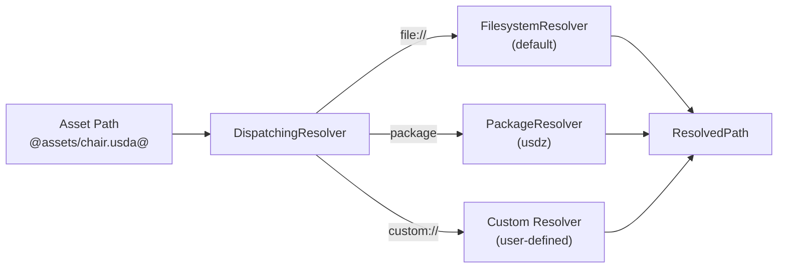
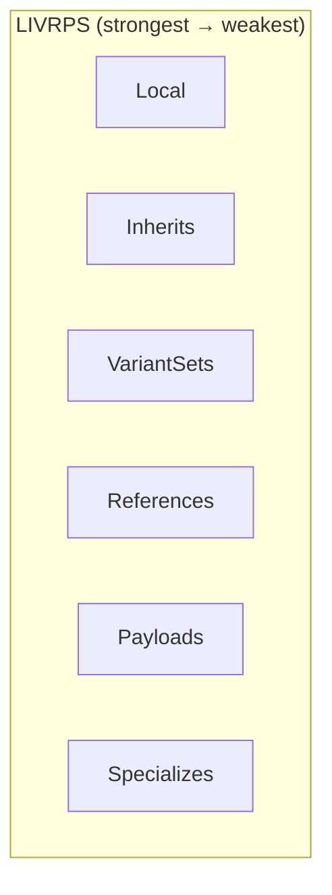

# USD Core Crates

The USD core crates implement the scene description, composition, and
high-level API. They correspond to `pxr/usd/` in C++ OpenUSD.

## usd-ar — Asset Resolution

**C++ equivalent:** `pxr/usd/ar`

Resolves logical asset paths to concrete filesystem paths.

### Key Types

| Type | Description |
|------|-------------|
| `Resolver` | Main resolver interface |
| `DispatchingResolver` | Routes to scheme-specific resolvers |
| `ResolvedPath` | A resolved (absolute) asset path |
| `ResolverContext` | Context for resolution (search paths, etc.) |
| `Asset` | Opened asset handle for reading |
| `WritableAsset` | Asset handle for writing |
| `Timestamp` | Modification timestamp for change detection |

### Architecture



## usd-sdf — Scene Description Foundation

**C++ equivalent:** `pxr/usd/sdf`

The lowest-level scene description API. Manages individual layers and their
raw (un-composed) content.

### Key Types

| Type | Description |
|------|-------------|
| `Layer` | A single file of scene description |
| `Path` | Hierarchical namespace path (`/World/Mesh.points`) |
| `PrimSpec` | Raw prim specification in a layer |
| `AttributeSpec` | Raw attribute specification |
| `RelationshipSpec` | Raw relationship specification |
| `Reference` | Reference arc descriptor |
| `Payload` | Payload arc descriptor |
| `LayerOffset` | Time offset + scale for sublayer composition |
| `AssetPath` | An asset reference path |
| `ValueTypeName` | Registry of recognized value type names |
| `ChangeList` | Record of changes to a layer |

### File Format Modules

| Module | Format | Description |
|--------|--------|-------------|
| `usda_reader` | `.usda` | Text parser (recursive descent) |
| `usdc_reader` | `.usdc` | Binary crate reader (LZ4, integer coding) |
| `usdz_file_format` | `.usdz` | ZIP package handler |
| `abc_reader` | `.abc` | Alembic reader |
| `text_parser` | -- | USDA grammar tokenizer/parser |

### Path Operations

```rust
use usd::sdf::Path;

let path = Path::from("/World/Mesh.points");
path.get_prim_path();     // /World/Mesh
path.get_name();          // points
path.get_parent_path();   // /World/Mesh
path.is_property_path();  // true
path.is_absolute_path();  // true

// Path construction
let child = path.append_child(&"Child".into());
let prop = path.append_property(&"extent".into());
```

## usd-pcp — Prim Cache Population

**C++ equivalent:** `pxr/usd/pcp`

The composition engine. Produces composed PrimIndexes from layered scene
descriptions.

### Key Types

| Type | Description |
|------|-------------|
| `Cache` | Main composition cache |
| `PrimIndex` | Composed index for a single prim (arc tree) |
| `PropertyIndex` | Composed index for a single property |
| `LayerStack` | Ordered set of sublayers with shared context |
| `Node` | One node in the PrimIndex tree (one arc) |
| `MapFunction` | Path translation between arc namespaces |
| `Arc` | Composition arc type (reference, payload, inherit, ...) |
| `Changes` | Computed change set for invalidation |

### Composition Arc Types



## usd-core — Core USD API

**C++ equivalent:** `pxr/usd/usd`

The high-level USD API providing `Stage`, `Prim`, `Attribute`, and related types.

### Key Types

| Type | Description |
|------|-------------|
| `Stage` | Composed scene container |
| `Prim` | A composed prim in the stage |
| `Attribute` | A composed attribute with value resolution |
| `Relationship` | A composed relationship |
| `Property` | Base for Attribute and Relationship |
| `EditTarget` | Directs edits to a specific layer |
| `TimeCode` | Time value for sampling |
| `StageLoadRules` | Payload loading configuration |
| `StagePopulationMask` | Selective prim population |
| `PrimFlags` / `PrimFlagsPredicate` | Prim traversal filtering |
| `SchemaRegistry` | Registry of schema types |
| `InstanceCache` | Instance-to-prototype mapping |
| `ClipCache` | Value clip resolution cache |

### Stage API Summary

```rust
// Creation
Stage::open(path, load) -> Result<Arc<Stage>>
Stage::create_new(path, load) -> Result<Arc<Stage>>
Stage::create_in_memory(load) -> Result<Arc<Stage>>

// Prim access
stage.get_prim_at_path(&path) -> Prim
stage.get_pseudo_root() -> Prim
stage.traverse() -> impl Iterator<Item = Prim>
stage.define_prim(&path, &type_name) -> Prim
stage.override_prim(&path) -> Prim
stage.remove_prim(&path) -> bool

// Layer access
stage.get_root_layer() -> Arc<Layer>
stage.get_session_layer() -> Arc<Layer>
stage.set_edit_target(&layer)

// Time
stage.get_start_time_code() -> f64
stage.get_end_time_code() -> f64
stage.set_start_time_code(t)
stage.set_end_time_code(t)

// Payload loading
stage.load(&path)
stage.unload(&path)
```

## usd-kind — Kind Registry

**C++ equivalent:** `pxr/usd/kind`

Model hierarchy classification. Standard kinds:
- `model` — base kind for all models
- `component` — leaf model (geometry, materials)
- `group` — container for other models
- `assembly` — top-level published asset
- `subcomponent` — sub-part of a component

## usd-sdr — Shader Definition Registry

**C++ equivalent:** `pxr/usd/sdr`

Discovers and registers shader node definitions from various sources (USD
files, MaterialX, OSL). Provides metadata about shader inputs, outputs, and
pages.

## usd-derive-macros

Procedural macro crate for generating schema boilerplate:
- Token constant generation
- Schema trait implementations
- Field accessor derivation
