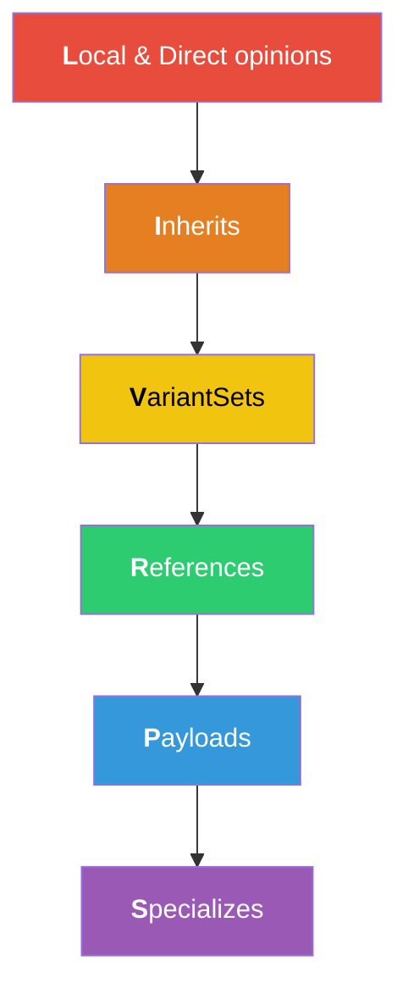
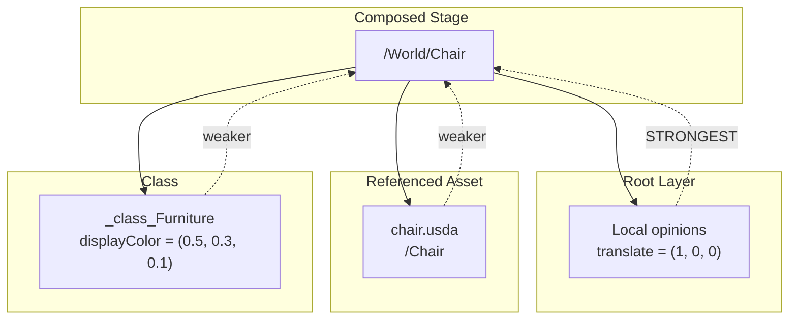

# Composition Arcs

Composition is the mechanism by which USD assembles a complete scene from
multiple layers and opinions. Understanding composition is key to working
effectively with USD.

## LIVRPS Strength Ordering

USD resolves conflicting opinions using a fixed strength order known as
**LIVRPS** (strongest to weakest):



When the same attribute is authored in multiple places, the strongest opinion
wins. Within each arc type, sublayer ordering and list-editing determine
precedence.

## Sublayers

Sublayers are the simplest composition arc. A layer can include other layers,
forming a stack where earlier sublayers are stronger.

```
#usda 1.0
(
    subLayers = [
        @./overrides.usda@,
        @./base.usda@
    ]
)
```

In this example, opinions in `overrides.usda` are stronger than `base.usda`,
which are stronger than the root layer itself (for direct opinions).

## References

References bring in scene description from another layer (or the same layer) at
a specific prim path.

```rust
use usd::{Stage, InitialLoadSet, Path};
use usd::sdf::{Reference, AssetPath};

let stage = Stage::create_in_memory(InitialLoadSet::All)?;
let prim = stage.define_prim(&Path::from("/World/Chair"), &"Xform".into());

// Add a reference to an external file
let refs = prim.get_references();
refs.add_reference(&Reference::new(
    AssetPath::from("assets/chair.usda"),
    Path::from("/Chair"),
));
```

References are commonly used to:
- Assemble a set from individual asset files
- Share geometry/material definitions across shots
- Build asset hierarchies (model → rig → anim → light)

## Payloads

Payloads work like references but can be **unloaded** to reduce memory. This is
the primary mechanism for deferred loading of heavy geometry.

```rust
use usd::sdf::Payload;

let payloads = prim.get_payloads();
payloads.add_payload(&Payload::new(
    AssetPath::from("heavy_geometry.usdc"),
    Path::from("/Geo"),
));
```

Load/unload payloads at runtime:

```rust
// Open with deferred payloads
let stage = Stage::open("scene.usda", InitialLoadSet::None)?;

// Load specific prims
stage.load(&Path::from("/World/Hero"));

// Unload
stage.unload(&Path::from("/World/Background"));
```

## Inherits

Inherits let a prim inherit opinions from a "class" prim (typically prefixed
with `_class_`). Changes to the class propagate to all inheriting prims.

```
class "_class_Tree" {
    double height = 10.0
    color3f displayColor = (0.2, 0.8, 0.1)
}

def "World" {
    def "Oak" (
        inherits = </_class_Tree>
    ) {
        double height = 25.0   # overrides class value
        # displayColor comes from _class_Tree
    }
}
```

## Specializes

Specializes is similar to inherits but weaker -- the specialized opinions are
the weakest of all arcs. This is useful for "base type" relationships where
the derived type should almost always win.

## VariantSets

VariantSets provide switchable alternatives within a single prim.

```
def "Car" (
    variants = {
        string color = "red"
    }
    prepend variantSets = "color"
) {
    variantSet "color" = {
        "red" {
            color3f displayColor = (1, 0, 0)
        }
        "blue" {
            color3f displayColor = (0, 0, 1)
        }
    }
}
```

```rust
// Read variant selections
let vsets = prim.get_variant_sets();
for name in vsets.get_names() {
    let vset = vsets.get_variant_set(&name);
    println!("{}: {} (options: {:?})",
        name,
        vset.get_variant_selection(),
        vset.get_variant_names(),
    );
}

// Set a variant selection
vsets.get_variant_set(&"color".into())
    .set_variant_selection("blue");
```

## Composition Diagram



The composed value of any attribute is determined by walking the composition
arcs in LIVRPS order and returning the first (strongest) authored opinion.
