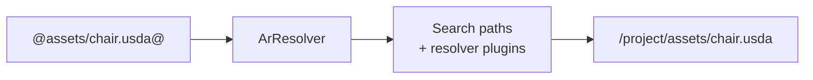

# File Formats

usd-rs supports multiple scene description file formats, all registered through
the SDF file format plugin system.

## Supported Formats

| Extension | Format | Description |
|-----------|--------|-------------|
| `.usda` | USD ASCII | Human-readable text format |
| `.usdc` | USD Crate | Compact binary format (fast I/O, random access) |
| `.usd` | USD Generic | Auto-detects binary vs text |
| `.usdz` | USDZ Package | Zip archive containing a root USD file + assets |
| `.abc` | Alembic | Interchange format for baked geometry caches |

## USDA (Text)

USDA is the human-readable serialization. It is useful for:
- Hand-editing scene descriptions
- Version control (diffable text)
- Debugging and inspection

```
#usda 1.0
(
    defaultPrim = "World"
    metersPerUnit = 0.01
    upAxis = "Y"
)

def Xform "World" {
    def Mesh "Cube" {
        float3[] points = [(-1,-1,-1), (1,-1,-1), ...]
        int[] faceVertexCounts = [4, 4, 4, 4, 4, 4]
        int[] faceVertexIndices = [0, 1, 3, 2, ...]
    }
}
```

The USDA parser and writer live in `usd-sdf` (`usda_reader` module).

## USDC (Binary Crate)

USDC is the optimized binary format. Features:
- Compact representation with structural sharing and compression
- Zero-copy access to large arrays
- LZ4 compression for integer and float arrays
- Token deduplication and string table

The USDC reader lives in `usd-sdf` (`usdc_reader` module) and uses the
`pxr-lz4` crate for decompression (compatible with OpenUSD's TfFastCompression).

### Compression Codecs

USDC uses several specialized compression schemes:

| Data type | Codec |
|-----------|-------|
| Integer arrays | Delta + zigzag + LZ4 |
| Float arrays | Integer-coded lookup + LZ4 |
| String arrays | Token table indices |
| Small values | Inline encoding |

## USDZ (Package)

USDZ is a zero-compression ZIP archive containing:
- A root `.usdc` or `.usda` file (first file in the archive)
- Referenced assets (textures, audio, etc.)

USDZ is the standard format for AR/mobile delivery (Apple AR Quick Look,
Android Scene Viewer).

```bash
# Create a USDZ package
usd zip scene.usdc textures/ -o package.usdz
```

The USDZ resolver (`usdz_resolver` in `usd-sdf`) handles transparent asset
resolution within the package.

## Alembic

The Alembic reader (`abc_reader` in `usd-sdf`) translates `.abc` files into
the SDF data model. This provides read-only access to:
- Polygon meshes and subdivision surfaces
- Curves and points
- Transform hierarchies
- Arbitrary geometry properties

## Asset Resolution

All file paths in USD go through the **Asset Resolution** system (`usd-ar`).
The resolver translates logical asset paths (e.g., `@assets/chair.usda@`) into
filesystem paths.



The `DispatchingResolver` routes resolution requests to scheme-specific
resolver plugins. Custom resolvers can be registered for specialized asset
management systems.

## Format Conversion

Use the CLI to convert between formats:

```bash
# USDA to USDC
usd compress scene.usda -o scene.usdc

# The file format is determined by extension
usd cat scene.usdc > readable.usda
```
