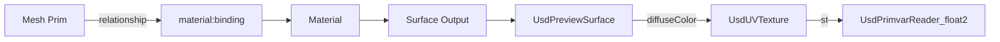

# Materials and Shading

The `usd-shade` crate implements USD's material and shader network model.

## Core Concepts



### Material

A `Material` is a container prim that holds shader networks. It has outputs
like `surface`, `displacement`, and `volume` that connect to specific shader
nodes.

### Shader

A `Shader` prim represents a single node in the shading network. Each shader
has a `shaderId` that identifies the shader implementation (e.g.,
`UsdPreviewSurface`, `UsdUVTexture`).

### Inputs and Outputs

Shader parameters are modeled as `Input` and `Output` objects. Connections
between shaders are expressed as relationships from an input to another
shader's output.

## Material Binding

Materials are assigned to geometry via `MaterialBindingAPI`:

```rust
use usd::{Stage, InitialLoadSet, Path, TimeCode};
use usd::tf::Token;

let stage = Stage::open("scene.usda", InitialLoadSet::All)?;
let mesh = stage.get_prim_at_path(&Path::from("/World/Mesh"));

// Check material binding
let binding_rel = mesh.get_relationship(&"material:binding".into());
if let Some(rel) = binding_rel {
    let targets = rel.get_targets();
    if let Some(mat_path) = targets.first() {
        println!("Bound material: {}", mat_path);
    }
}
```

### Binding Purpose

Material bindings can be purpose-qualified:

| Purpose | Attribute | Usage |
|---------|-----------|-------|
| All purposes | `material:binding` | Default binding |
| Full | `material:binding:full` | Full-quality rendering |
| Preview | `material:binding:preview` | Viewport / preview rendering |

## UsdPreviewSurface

The standard preview material in USD, supported by all renderers:

```
def Material "SimpleMaterial" {
    token outputs:surface.connect = </SimpleMaterial/Surface.outputs:surface>

    def Shader "Surface" {
        uniform token info:id = "UsdPreviewSurface"
        color3f inputs:diffuseColor = (0.8, 0.2, 0.1)
        float inputs:roughness = 0.4
        float inputs:metallic = 0.0
        token outputs:surface
    }
}
```

### UsdPreviewSurface Parameters

| Parameter | Type | Default | Description |
|-----------|------|---------|-------------|
| `diffuseColor` | color3f | (0.18, 0.18, 0.18) | Base color |
| `emissiveColor` | color3f | (0, 0, 0) | Emissive light |
| `roughness` | float | 0.5 | Surface roughness |
| `metallic` | float | 0.0 | Metallic factor |
| `opacity` | float | 1.0 | Opacity |
| `ior` | float | 1.5 | Index of refraction |
| `normal` | normal3f | (0, 0, 1) | Normal map |
| `displacement` | float | 0 | Displacement amount |
| `occlusion` | float | 1 | Ambient occlusion |
| `specularColor` | color3f | (0, 0, 0) | Specular tint |
| `useSpecularWorkflow` | int | 0 | 1 = specular, 0 = metallic |
| `clearcoat` | float | 0.0 | Clearcoat intensity |
| `clearcoatRoughness` | float | 0.01 | Clearcoat roughness |

## Texture Mapping

```
def Shader "DiffuseTexture" {
    uniform token info:id = "UsdUVTexture"
    asset inputs:file = @textures/albedo.png@
    float2 inputs:st.connect = </Material/UVReader.outputs:result>
    token inputs:wrapS = "repeat"
    token inputs:wrapT = "repeat"
    float3 outputs:rgb
}

def Shader "UVReader" {
    uniform token info:id = "UsdPrimvarReader_float2"
    string inputs:varname = "st"
    float2 outputs:result
}
```

## MaterialX Integration

The `usd-mtlx` and `usd-hd-mtlx` crates provide MaterialX support for
advanced material networks beyond UsdPreviewSurface. Enable with the `mtlx-rs`
feature flag.

## Coordinate System Binding

`CoordSysAPI` allows binding named coordinate systems to prims for use in
shader networks that need object-space or custom-space coordinates.
