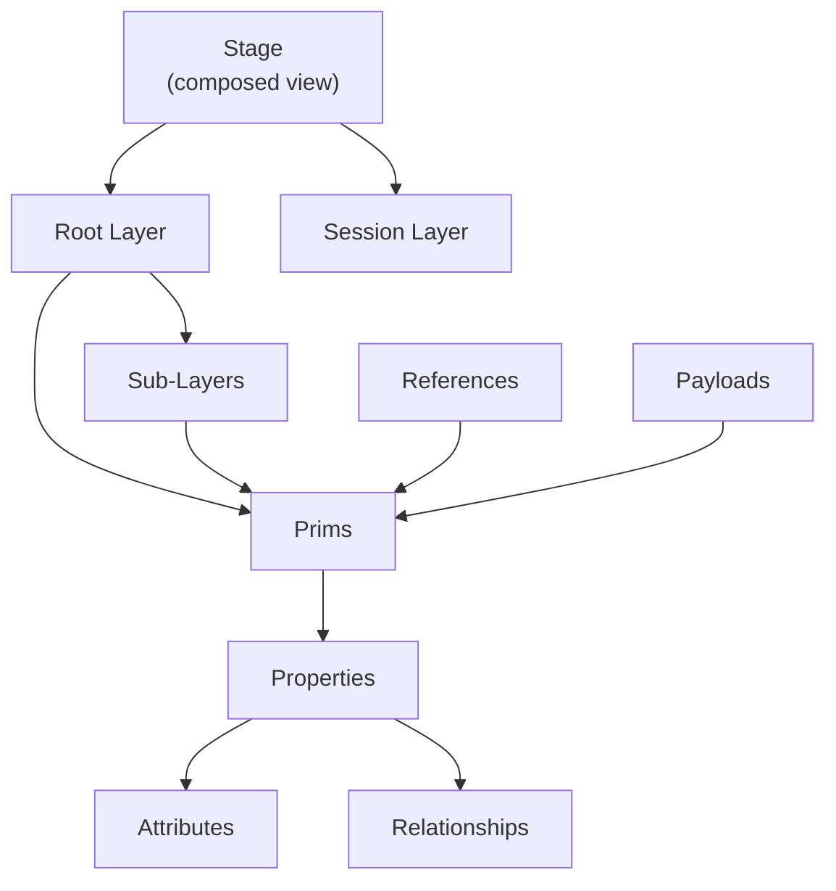
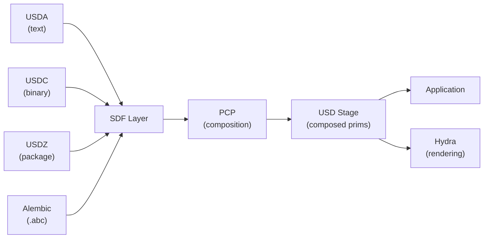

# Overview

This chapter provides a bird's-eye view of the usd-rs data model and how the
major concepts relate to each other.

## Core Concepts



### Stage

The `Stage` is the outermost container. It owns a **root layer** (the primary
file), an optional **session layer** (non-persistent overrides), and presents
the fully composed prim hierarchy. All composition -- sublayers, references,
payloads, inherits, specializes, variant sets -- is resolved transparently.

### Layer

A `Layer` is a single file of scene description (`.usda`, `.usdc`, or `.usdz`).
Layers are the unit of serialization and collaboration. Multiple layers are
composed into a single stage view via the composition engine.

### Prim

A `Prim` (primitive) is a node in the scene hierarchy. Every prim has:
- A **path** (e.g., `/World/Character/Mesh`)
- A **type** (e.g., `Mesh`, `Xform`, `Material`)
- Zero or more **properties** (attributes and relationships)
- Zero or more **children** (child prims)

### Attribute

An `Attribute` holds typed data that can vary over time. Examples: `points`
(vertex positions), `displayColor`, `xformOp:translate`. Attributes can have
**default values** and **time samples**.

### Relationship

A `Relationship` is a pointer from one prim to another. Examples: material
bindings (`material:binding`), skeleton bindings, collection members.

## Data Flow



1. **File I/O**: USDA (text), USDC (binary crate), USDZ (zip package), and
   Alembic files are parsed into SDF layer objects.
2. **Composition**: The PCP (Prim Cache Population) engine composes layers
   using LIVRPS strength ordering (Local, Inherits, VariantSets, References,
   Payloads, Specializes).
3. **USD Stage**: Presents the composed result as a flat prim hierarchy with
   resolved attributes.
4. **Consumption**: Applications read composed data directly, or feed it into
   Hydra for rendering.

## The Facade Crate

The top-level `usd` crate is a thin facade that re-exports all sub-crates under
a unified namespace:

```rust
use usd::Stage;           // usd-core::Stage
use usd::sdf::Layer;      // usd-sdf::Layer
use usd::sdf::Path;       // usd-sdf::Path
use usd::tf::Token;       // usd-tf::Token
use usd::gf;              // usd-gf (math)
use usd::vt::Value;       // usd-vt::Value
use usd::usd_geom;        // usd-geom (geometry schemas)
use usd::imaging::hd;     // usd-hd (Hydra core)
```

This mirrors the `pxr` namespace from C++ OpenUSD, where you would write
`pxr::UsdStage`, `pxr::SdfLayer`, etc.
