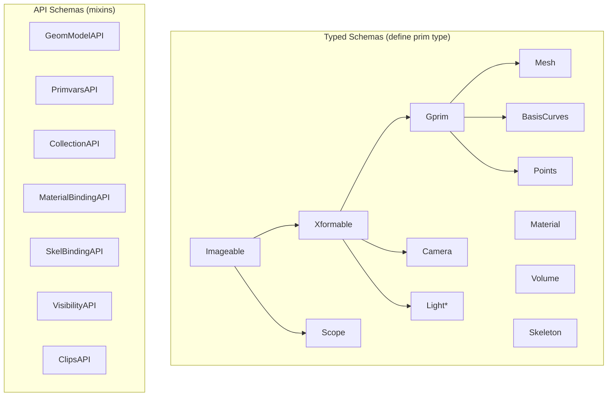

# Schemas

USD schemas define the expected attributes and behavior for prim types. usd-rs
implements all standard OpenUSD schema families.

## Schema Categories



### Typed Schemas

A **typed schema** defines the prim's type name (e.g., `Mesh`, `Xform`,
`Material`). A prim can have exactly one typed schema.

### API Schemas

An **API schema** adds extra attributes and behavior to any prim, regardless
of its type. Multiple API schemas can be applied to the same prim.

## Geometry Schemas (`usd-geom`)

The geometry module provides schemas for renderable primitives.

### Mesh

```rust
use usd::{Stage, InitialLoadSet, Path, TimeCode};

let stage = Stage::open("scene.usda", InitialLoadSet::All)?;
let prim = stage.get_prim_at_path(&Path::from("/World/Mesh"));

// Read mesh topology
let points_attr = prim.get_attribute(&"points".into());
let counts_attr = prim.get_attribute(&"faceVertexCounts".into());
let indices_attr = prim.get_attribute(&"faceVertexIndices".into());
let normals_attr = prim.get_attribute(&"normals".into());

if let Some(attr) = &points_attr {
    let count = attr.get_num_time_samples();
    println!("Points has {} time samples", count);
}
```

### Transforms (Xform)

```rust
// Transform operations are stored as ordered xformOps
let ops = prim.get_attribute(&"xformOp:translate".into());
let rotate = prim.get_attribute(&"xformOp:rotateXYZ".into());
let scale = prim.get_attribute(&"xformOp:scale".into());

// The xformOpOrder attribute defines the order of application
let order = prim.get_attribute(&"xformOpOrder".into());
```

### Implicit Surfaces

usd-rs supports implicit geometry types that are synthesized into renderable
mesh topology at imaging time:

| Type | Schema | Description |
|------|--------|-------------|
| `Cube` | `UsdGeomCube` | Axis-aligned unit cube |
| `Sphere` | `UsdGeomSphere` | Unit sphere |
| `Cylinder` | `UsdGeomCylinder` | Capped cylinder |
| `Cone` | `UsdGeomCone` | Capped cone |
| `Capsule` | `UsdGeomCapsule` | Cylinder with hemispherical caps |
| `Plane` | `UsdGeomPlane` | Finite plane |

### Primvars

Primvars (primitive variables) are attributes with interpolation metadata.
They control how data is distributed across geometry (constant, uniform,
vertex, faceVarying).

```rust
// Primvars are accessed through PrimvarsAPI
let st = prim.get_attribute(&"primvars:st".into());
let st_indices = prim.get_attribute(&"primvars:st:indices".into());
```

### Other Geometry Types

| Crate module | Types |
|-------------|-------|
| `basis_curves` | BasisCurves, HermiteCurves, NurbsCurves |
| `points` | Points |
| `nurbs_patch` | NurbsPatch |
| `point_instancer` | PointInstancer |
| `tet_mesh` | TetMesh |
| `subset` | GeomSubset |

## Lighting Schemas (`usd-lux`)

Lighting schemas define light sources:
- `DistantLight`, `DomeLight`, `RectLight`, `SphereLight`, `CylinderLight`,
  `DiskLight`
- `PortalLight`, `GeometryLight`
- Light filters and shadow linking

## Skeleton Schemas (`usd-skel`)

Skeletal animation schemas:
- `Skeleton` -- joint hierarchy
- `SkelAnimation` -- joint transforms over time
- `SkelRoot` -- scope for skinning
- `SkelBindingAPI` -- binds geometry to skeletons

## Volume Schemas (`usd-vol`)

Volumetric data schemas:
- `Volume`, `OpenVDBAsset`, `Field3DAsset`

## Physics Schemas (`usd-physics`)

Rigid body and collision schemas:
- `RigidBodyAPI`, `CollisionAPI`, `MassAPI`
- `Joint`, `FixedJoint`, `RevoluteJoint`, `PrismaticJoint`
- `Scene` (physics scene parameters)

## Other Schema Families

| Crate | C++ Module | Purpose |
|-------|-----------|---------|
| `usd-render` | UsdRender | Render settings, products, vars |
| `usd-media` | UsdMedia | Spatial audio |
| `usd-proc` | UsdProc | Generative procedurals |
| `usd-ri` | UsdRi | RenderMan-specific schemas |
| `usd-ui` | UsdUI | UI hints (backdrops, node graphs) |
| `usd-semantics` | UsdSemantics | Semantic labels and taxonomies |
| `usd-hydra` | UsdHydra | Hydra interop schemas |
